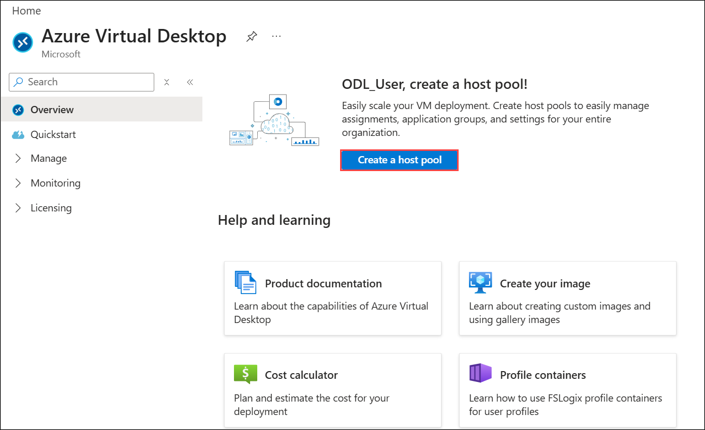
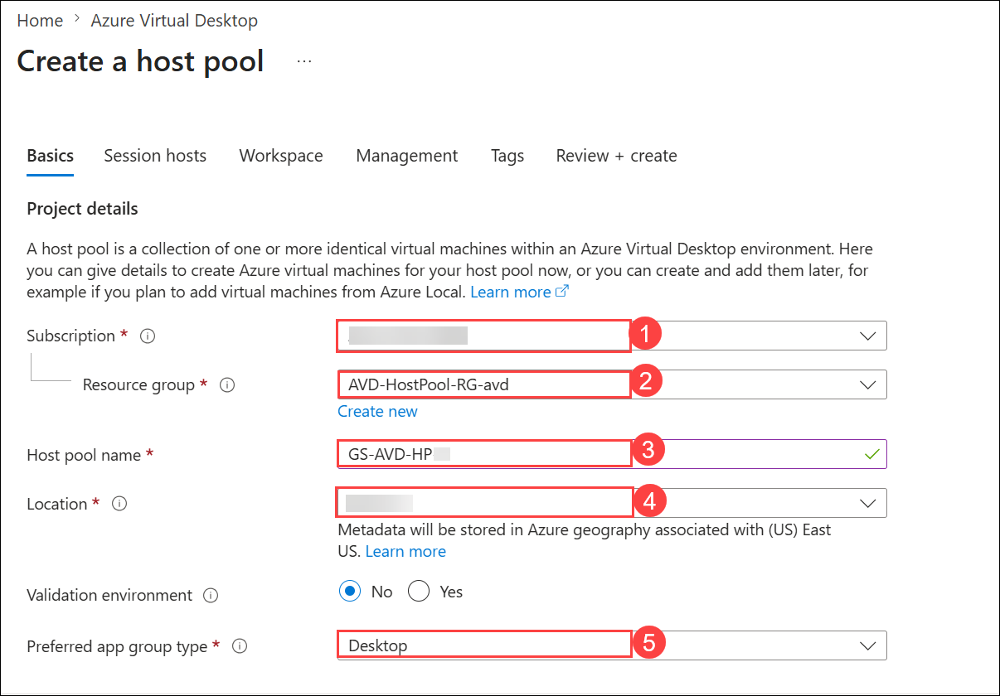
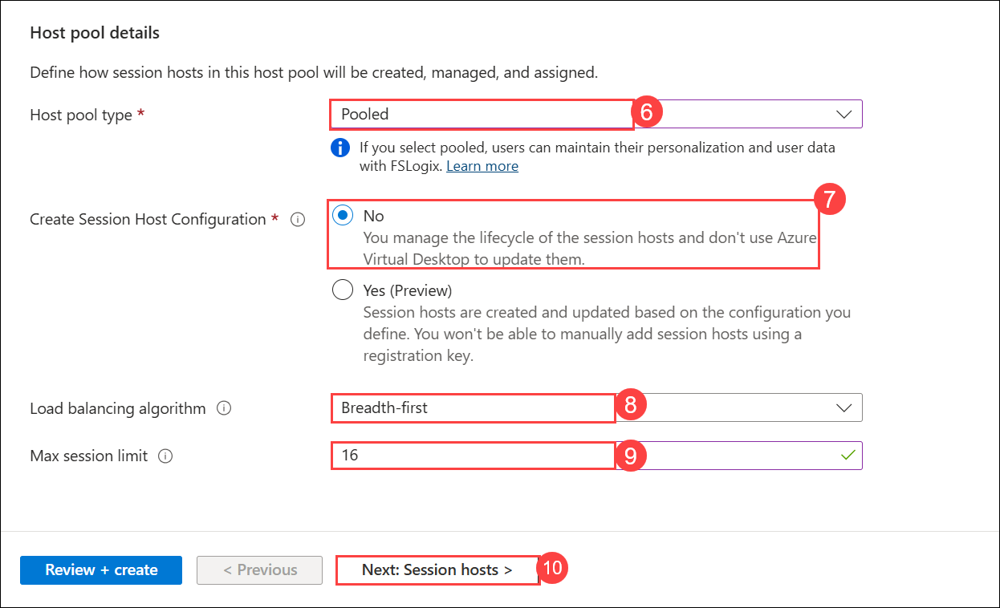
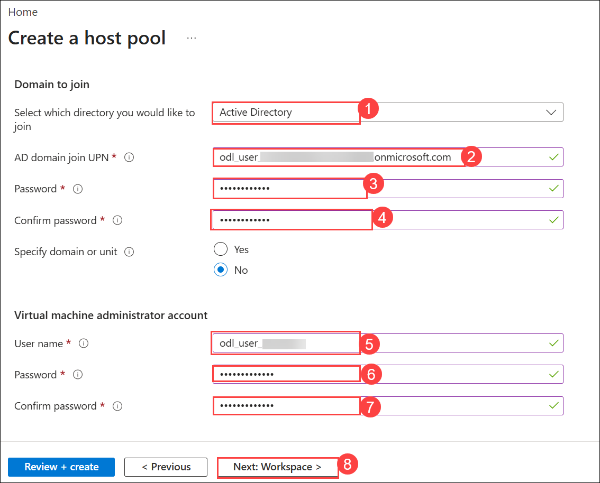
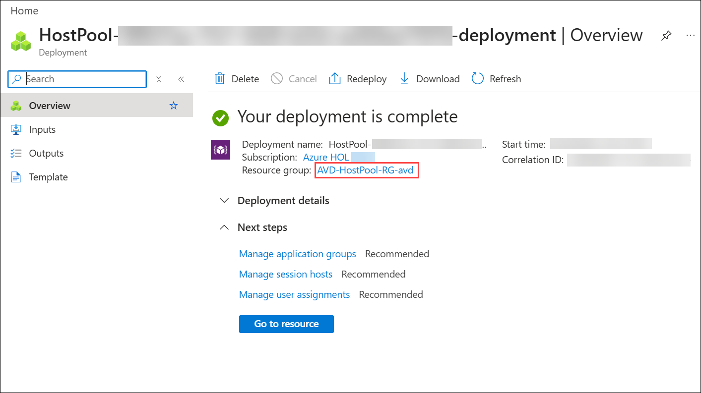

# Lab 1: Create Host Pool using Getting Started Wizard

### Estimated Duration: 40 Minutes

## Lab Scenario

Contoso is planning to set up its infrastructure on Azure. As a first step, you need to provision a host pool for Azure Virtual Desktop. The host pool creation includes session hosts, a default application group, and a workspace.

A host pool is a collection of Azure virtual machines that register with Azure Virtual Desktop as session hosts. All session hosts should use the same image for a consistent user experience.

## Lab Objective

In this lab, you will complete the following exercise:

- Exercise 1: Create Host Pool using Getting Started Wizard

## Exercise 1: Create Host Pool using Getting Started Wizard

In this exercise, you will create an Azure Virtual Desktop (AVD) host pool through the Getting Started Wizard. You will add session hosts, configure domain join, and register the workspace.

> **Important:** From your Lab VM desktop, open the **AzureCreds** file and copy the **AzurePassword** shown in Notepad. This password is required for some lab steps.

1. On the **Azure portal,** search for **Azure Virtual Desktop** **(1)** in the search bar and select **Azure Virtual Desktop** **(2)** from the suggestions.

   

1. On the Azure Virtual Destop Page, **Click** on the **Create a host pool**.

   

1. On the **Create a host pool** page, under **Project details**, configure the following settings:

   | Setting | Value |
   |---------|-------|
   | Subscription | Leave the default subscription selected **(1)** |
   | Resource group | Select **AVD-HostPool-RG-avd (2)** |
   | Host pool name | Enter **GS-AVD-HP (3)** |
   | Location | Select **<inject key="Region" enableCopy="false"/> (4)** from the **Location** drop-down list. |
   | Preferred app group type | Verify that **Desktop (5)** is selected. |

   > **Note:** Leave all other settings with their default values unless instructed otherwise.

      

1. In the **Host pool details** section, configure the following settings, and then select **Next: Session hosts > (10)** to proceed.

   - Host pool type: Verify that **Pooled (6)** is selected.
   - Create Session Host Configuration: Select **No (7)**.
   - Load balancing algorithm: Verify that **Breadth-first (8)** is selected.
   - Max session limit: Enter **16 (9)**.

      

1. On the **Session hosts** section, enter the required information as follow:

   - Add virtual machines: **Yes (1)**
   - Resource Group: **AVD-HostPool-RG-avd (2)**
   - Name prefix: **AVD-HP01-SH (3)**
   - Virtual machine type: **Azure virtual machine (4)**
   - Virtual machine location: Select **<inject key="Region" enableCopy="false"/> (5)** from the drop-down list.
   - Availability options: **No infrastructure redundancy required (6)**
   - Security type: **Trusted launch virtual machines (7)**

      

1. In the **Image**, click on **See all images** to choose the required images.

   

1. In the **Select an image** pane, search for **Windows multi-session (1)**. Under **Windows multi-session + Microsoft 365 Apps**, select **Select (2)**, choose **Windows 11 Enterprise multi-session, version 25H2 + Microsoft 365 Apps - x64 Gen 2** from the drop-down list, and then select **Select**. *(choose from dropdown)*

   
   

2. For **Virtual machine size**, select **Change size**, search for **D4s_v4 (1)**, select **D4s_v4 (2)**, and then select **Select (3)**.

   

1. Provide the information as mentioned below:
   
   - Number of VMs: **2 (1)**
   - OS disk type: **Standard HDD (2)**
   - OS disk size: **Default size (128 GiB) (3)**

      

1. On the **Network and security** section, enter the required information as follow:

   >**Note:** Make sure to select the subnet as **sessionhosts-subnet(10.0.1.0/24)**

   - Virtual Network: **aadds-vnet (1)** *(choose from dropdown)*
   - Subnet: **sessionhosts-subnet(10.0.1.0/24) (2)** *(choose from dropdown)*
   - Network security group type: **Basic (3)**

      

1. Enter the required details for **Domain to join** and **Virtual machine administrator account** as specified below, then click **Next: Workspace > (8)**

- **Domain to join**

   - Select which directory you would like to join: **Active Directory (1)**
   - AD domain join UPN: **<inject key="AzureAdUserEmail"></inject> (2)**
   - Password: **Use the password form AzureCreads file (3)**
   - Confirm password: **Use the password form AzureCreads file (4)**

- **Virtual machine administrator account**

   - User name: **odl_user_<inject key="DeploymentID" enableCopy="false"/>(5)**
   - Password: **Password!1234 (6)**
   - Confirm password: **Password!1234 (7)**

      

12. In the **Workspace section**, select **Yes (1)** for **Register desktop app group**.  

1. For **To this workspace**, click on **Create new (2)**.

1. Enter **GS-AVD-WS (3)** as the workspace name.

1. Click **OK (4)** to confirm.

   

1. Click on **Review + Create**, then click **Create**.

   

   >**NOTE**: Usually it takes 20 minutes to get deployed successfully. Sometimes it might take up to 90 minutes.
   
1. Once the deployment succeeds, it will look similar to the image shown below: 
   - Click on **AVD-HostPool-RG-avd** to navigate to the resource group.

      

1. Select **GS-AVD-HP** host pool.

   
   
1. It will take you to the **Host pool**. The resources created are as follows,

    - **Host Pool**: 1 (GS-AVD-HP)
    - **Session Host**: 2 (AVD-HP01-SH-0, AVD-HP01-SH-1)
    - **Application Group**: 1 (GS-AVD-HP-DAG)
    - **Application**: 1 (SessionDesktop)
    - **Workspace**: 1 (GS-AVD-WS)

      

   > **Congratulations** on completing the task! Now, it's time to validate it. Here are the steps:
- Scroll down and hit the Validate button in the lab guide for the corresponding task. If you receive a success message, you can proceed to the next task.
- If not, carefully read the error message and retry the step, following the instructions in the lab guide.
- If you need any assistance, please contact us at cloudlabs-support@spektrasystems.com. We are available 24/7 to help you out.

<validation step="97d211ae-121b-445b-a278-054cda35de33" />   

## Summary
In this lab, you created an Azure Virtual Desktop host pool using the Getting Started Wizard. You added session hosts, joined them to the domain, and registered the environment to a workspace for AVD access.

Now select the **Next** button in the bottom-right corner of this lab guide.

 
