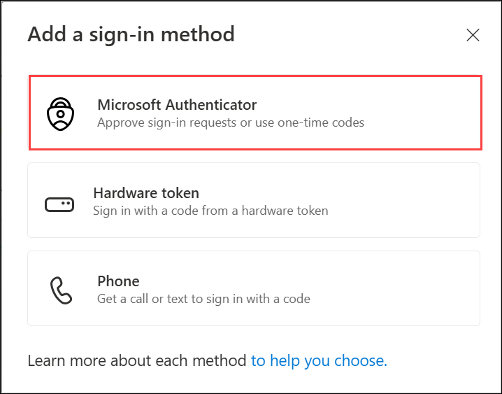

# Lab 11: Security Modules

### Estimated Duration: 50 Minutes

## Lab Scenario

Contoso wants its resources to be secure and protected from any kind of unethical activities. So Contoso wants to enable Multi-factor authentication (MFA) for session login. You will guide Contoso to set up MFA for sign-ins.

In this lab, you will be enabling Multi-Factor authentication, Multi-factor authentication is a process where a user is prompted during the sign-in process for an additional form of identification, which increases the level of security.

## Lab Objectives

In this lab, you will complete the following exercises:

- Exercise 1: Setup Multi-Factor Authentication (MFA)
- Exercise 2: Creating Conditional Access Policy
- Exercise 3: Screen Capture Protection
- Exercise 4: App Locker

## Exercise 1: Setup Multi-Factor Authentication (MFA)

In this exercise, you will set up Multi-Factor Authentication (MFA) by signing in to the security verification page, adding Microsoft Authenticator as a sign-in method, configuring the app on your mobile device, scanning the QR code, and completing verification to successfully enable MFA for your account.

1. In your JumpVM launch browser and visit the below link and if asked to log in then log in using the following credentials:

   ```
   https://AKA.ms/proofup
   ```
   - Username: **<inject key="AzureAdUserEmail"></inject>**
   - Password: **<inject key="AzureAdUserPassword"></inject>**
   
1. If there is pop-up entitled **Stay signed in?** with buttons for **No** and **Yes** - Choose **No**.  

    
    
1. If you're automatically signed in using the **<inject key="AzureAdUserEmail"></inject>**, proceed to the **Security info** page. Click on **+ Add sign-in method**.

   

1. In the pop-up, choose **Microsoft Authenticator** and follow the on-screen steps to complete setup.

   

1. Download the **Microsoft Authenticator** app on your Mobile from the App Store.

1. After installing the app, select **Next**.

   
   
1. In the Microsoft Authenticator app, set up your account by adding a work or school account. After adding an account select **Next**.

   
   
1. To connect the Microsoft Authenticator app with your account, **Scan the QR code (1)** and select **Next (2)**.

   

1. A Notification to Approve will pop up on your mobile. Enter the popped-up number in your mobile for verification.
   
   

1. Approve that.
  
1. Once Success! Great job! You have successfully set up your security info. Choose **Done** to continue signing in.

   
  
## Exercise 2: Creating Conditional Access Policy

In this exercise, you will create and configure a Conditional Access policy by disabling security defaults (if enabled), defining a new AVD-specific MFA policy, assigning your user and Azure Virtual Desktop as the target resource, enabling MFA as the required access control, and finally validating the policy by signing in through the Remote Desktop Web Client and completing MFA authentication.

1. In Azure Portal search for **Microsoft Entra ID (1)** and click on it from the search result **(2)**.

   

2. From the left-hand side blade, click on **Properties** **(1)** under **Manage** and scroll down to select **Manage Security Defaults** **(2)** at the bottom of the page.

   >**Note:** If you're unable to disable the security defaults and see Manage Conditional Access, it means the organization is already using a conditional access policy (e.g., AVD-MFA). In that case, you can skip the below steps and jump directly to step 9.
   
   
   
4. In **Security defaults** pane, for **Security defaults** make sure it is selected to **Disable**.
 
   > **Note:** Please ignore and proceed further if you find any survey points by Azure below **Enable Security defaults** option
   
   

5. From the left-hand side blade, click on **Security** under Manage blade.

   
  
6. In **Security** page, select **Conditional Access** under Protect blade.

   
  
7. In the Overview page, click on **+ Create New Policy**.

   

8. Configure the Conditional Access Policy with the following details:

   - Name: **AVD-MFA** **(1)**
   - **Assignments**:
     - Click on **0 users or agents (Preview) selected** **(2)** under Users or agents (Preview) option.
     - A new window will slide in, click on **Select users and Groups** **(3)** and then select the check box saying **Users and groups** **(4)**
     - Now a Select window will open, here search for ODL user **<inject key="AzureAdUserEmail"></inject>** then select it and then click on **Select** **(5)** button.
   
         
   
      - Click on **No target resources selected** **(1)** under Target resources option.
      - Click on **Select Resources** **(2)**
      - Click on **None (3)** under `Select specific resource`.
      - Search for **Azure Virtual Desktop** and click on the **check box** of **Azure Virtual Desktop** **(4)** next to the search result
      - Now Click on **Select** **(5)** button.

         

           > **Note:** If you're unable to find any resource named Azure Virtual Desktop, try searching for **Windows Virtual Desktop**.

      - Click on **0 conditions selected** **(1)** under Conditions option.
      - Then select **Client apps** **(2)**
      - Now in the Client Apps blade, toggle the *Configure* switch to **Yes** **(3)** and make sure that all the checkboxes below are selected.
      - Then click on **Done** **(4)**

         
  
      - Click on **0 controls selected (1)** of `Grant` Section under the Access Control option.
      - in the **Grant** pane, click on **Grant access**
      - Select the check Box saying **Require multi-factor authentication** **(2)** 
      - Then click on **Select** **(3)**

         
   
8. Toggle the **Enable Policy** switch to **On (1)** and click on **Create (2)**.

   
  
9. Now, Open the following URL in a new browser tab in the JumpVM. This URL will lead us to the Remote Desktop Web Client.

      ``` 
      aka.ms/wvdarmweb 
      ``` 

    >**Note:** If you are already logged in through your user, then jump to Exercise 3 else continue with the next step i.e., Step 10.

10. Now to log in, enter the lab credentials as mentioned below:

      - Username: Paste the username **<inject key="AzureAdUserEmail"></inject>** and then click on **Next**.
   
         

      - Password: Paste the password **<inject key="AzureAdUserPassword"></inject>** and click on **Sign in**.

         
   
11. You'll see a dialog box to authenticate your login which is the indication of MFA implementation. Authenticate the login according to the authentication method you have chosen in exercise 1, step 7 to complete the verification.

     

     >**Note:** If there's a dialog box saying ***Stay signed in***, then select the **No** option.

     
   
12. The AVD dashboard will be launched. 

    

## Exercise 3: Screen Capture Protection

In this exercise, you will enable and validate Screen Capture Protection for Azure Virtual Desktop by switching the host pool to a validation environment, connecting through the Remote Desktop client, installing and applying AVD Group Policy templates, configuring the Screen Capture Protection policy and registry settings, and finally confirming the feature by capturing a screenshot that shows the session desktop blacked out.

1. Return to the Azure portal in your browser inside the **JumpVM**, search for **Host pools (1)** and click on **Host pools (2)** from the search result.

   
   
1. Now click on **GS-AVD-HP** host pool to access it.

   
   
1. Under Settings, click on **Properties**.

   
   
1. On the Properties page, select **Yes (1)** for **Validation environment** and click on **Save (2)**.

   
   
1. Navigate to **Your Own PC/computer/workstation**, go to **Start** search for **Windows App** and open the application with the exact icon as shown below.

   
   
1. Click on the **account icon** in the top-right corner, then select **Sign in with another account**.

    

1. Enter the user credentials to access the workspace.

     >**Note**: If there is already an account signed in on your PC, click on + Use another account to authenticate using the user provided below.

    - Username: Paste the username **<inject key="AzureAdUserEmail"></inject>** and then click on **Next**.
   
      

    - Password: Paste the password **<inject key="AzureAdUserPassword"></inject>** and click on **Sign in**.

      
      
      >**Note:** Once you enter the credentials, if there is an authentication request sent to the registered device, **Approve** it using the **Microsoft Authenticator App**
   
1. Once you are signed in to the AVD client, double-click on the **SessionDesktop**.

   
   
1. A window saying **Connecting to SessionDesktop** will appear. Wait for a few seconds, then enter your password to access the Desktop.
   
   > **Note:** If you are unable to sign in using the provided password, try logging in with the **AzurePassword** available in the **AzureCreds** file on the desktop.

   - Password: **<inject key="AzureAdUserPassword"></inject>**
   
      

1. While the Session Desktop is connecting, we can see a message saying **Starting remote PC**.

   
   
1. From the Session desktop, search for **Microsoft edge (1)** from the search bar and select it **Microsoft edge (2)**

   

1. On the **Welcome to Microsoft Edge** page, click on **Start without your data** -> Then click on **Confirm and continue** -> **Continue without google data** -> Then **Confirm and start browsing**. 
   
1. Download the **Azure Virtual Desktop policy templates file** (AVDGPTemplate.cab) using the below URL.

   ```
   https://aka.ms/avdgpo
   ```

1. Once the file is downloaded, click on the **folder** icon to open the file.   

   
 
1. Double-click on **AVDGPTemplate** Cabinet file to see the zip file and then right click on the Zip file and select **Extract** to extract the **AVDGPTemplate** zip file to the default path.

   
   
   

1. Now navigate to **Documents** folder, right-click on **AVDGPTemplate** **(1)** zip file and select **Extract All...** **(2)**.

   
   
1. In the Select a Destination and Extract file pane, select **Extract**.

   

1. Navigate to the path **C:\Users\ODL_UserDID\Documents\AVDGPTemplate**, please replace **DID** in **ODL_UserDID** with **<inject key="DeploymentID" enableCopy="false"/>** and copy the **terminalserver-avd.admx** file to **C:\Windows\PolicyDefinitions** folder. 

   

   

   >**Note**: If you get any pop-out stating that the **Destination Folder Access Denied**, click on **Continue**.

   
   
1. Navigate to the path **C:\Users\ODL_UserDID\Documents\AVDGPTemplate\en-us**, please replace **DID** in **ODL_UserDID** with **<inject key="DeploymentID" enableCopy="false"/>** and copy **terminalserver-avd.adml** file to **C:\Windows\PolicyDefinitions\en-us** folder.

   

   

   >**Note**: If you get any pop-out stating that the **Destination Folder Access Denied**, click on **Continue**.

   
   >**Note**: Ensure **.admx** file are placed in the **PolicyDefinitions** folder and corresponding **.adml** file in the appropriate language subfolder **(en-US)**. Incorrect placement may cause policy errors.
   
1. From the Start menu of your Session Desktop, search for **group policy** and select **Edit group policy**.

   
   
1. On the Local group policy editor pane, navigate to the path **Computer Configuration -> Administrative Templates -> Windows Components -> Remote Desktop Services -> Remote Desktop Session Host -> Azure Virtual Desktop**.

1. On the Azure Virtual Desktop tab, right-click on the **Enable Screen Capture Protection (1)** and click on **Edit (2)**.

    
    
1. On the **Enable Screen Capture Protection** tab, follow the below instructions:
 
    - Select **Enabled (1)**
    - Click on **Apply (2)**
    - Click on **Ok (3)**

        

     >**Disclaimer**: Once **screen capturing protection** is enabled, accessing the host via the web version will no longer be possible. You will only be able to connect using the **Remote Desktop client**.

1. From the Start menu of Session Desktop, search for **Registry Editor** and select it.

    
    
    > **Note:** If you are prompted with any pop-up stating **Do you want to allow this app to make any changes to your device?**, click on **Yes**.
    
1. Navigate to the path **Computer\HKEY_LOCAL_MACHINE\SOFTWARE\Policies\Microsoft\Windows NT\Terminal Services**.

1. Right-click on the Terminal Services workspace, select **New (1)** and click on **DWORD (32-bit) value (2)**.

    
    
1. Enter the **Value name** as **fEnableScreenCaptureProtection**.

1. Now right-click on the newly created register key *fEnableScreenCaptureProtection* and click on **Modify**.

    
    
1. On the **Edit DWORD (32-bit) value** dialog box, follow the below instructions:

    - Value data : Enter **1 (1)**
    - Select **Decimal (2)** under **Base**
    - Click on **Ok (3)**

      
     
1. Restore the session host and take a screenshot using the Snipping tool from your Local desktop.

    

1. In **Your Own PC/computer/workstation**, go to Start Menu and search for **Snipping tool** then select it from search results.

    

1. Then in the **Snipping tool**, click on drop-down button next to **Mode** and select **Full-Screen**.

    

1. Click **+ New**.

    

1. You will get a screenshot with the Session desktop blacked out, the blacked-out screenshot as mentioned in the below screenshot.

   >**Disclaimer**: Once **screen capturing protection** is enabled, accessing the host via the web version will no longer be possible. You will only be able to connect using the **Remote Desktop client**.

   
   
   >**Note:** If you are not able to capture the blacked-out screenshot of the session desktop, re-start the session desktop and re-perform the above step
   
1. In your Own PC, open File Explorer navigate to **Pictures/Screenshots** and open the screenshot you took in the above step
   
1. Now you have successfully enabled the Screen Capture Protection in your Session host.

## Exercise 4: App Locker

In this exercise, you will enable and validate App Locker within the session host by starting the Application Identity service, configuring App Locker rule enforcement, creating a packaged app rule that blocks Microsoft Photos, and testing the policy by attempting to launch the Photos app to confirm it is successfully restricted.

1. Within the same Session Desktop, from the Start menu search for **Services (1)** and select it from search results **(2)**.

   
   
1. On the **Services** tab, right click on **Application Identity (1)** and click on **Start (2)**.

   
   >**Note**: If the service is already running, ignore this step and continue with next step
   
1. Minimize the Services window and search for **Local Security Policy (1)** from Start menu and select it from search results **(2)**.

    
    
1. Navigate to **Application Control Policy** -> **App Locker**.

1. Right click on **App Locker (1)** and click on **Properties (2)**.

    
    
1. On **App Locker Properties** tab, check the box next to **Configured** for **Executable runs (1)**, **Windows Installer Rules (2)**, **Script Rules (3)**, **Packaged app Rules (4)** and click on **Apply (5)** then select **Ok (6)**.

     
     
1. Navigate to  **Application Control Policy** -> **App Locker** -> **Packaged app Rules** then right click on **Packaged app Rules (1)** under App Locker and select **Create New Rule (2)**.

    
    
1. On the **Create New Rules** window, follow the below instructions:

    - Leave everything default under **Before You Begin** and click on **Next**.

      
      
    - On **Permissions** tab, click on **Deny (1)** under Action and select **Next (2)**.

      
      
    - On **Published (1)** tab, choose **Use an installed packaged app for reference (2)** and click on **Select (3)**.

       
       
    - On **Select applictions** tab, scroll down to **Microsoft Photos (1)** and select it then click on **Ok (2)**.

       
       
    - Click on **Next**.

       
         
    - On **Exceptions (1)** tab, leave everything as default and click on **Create (2)**.

      
      
    - If you get any pop-out for **App Locker** permissions, click on **No**.

      
       
1. Within the same Session Desktop, from the Start menu search for **Photos (1)** and select **(2)**.
      
    
      
1. You will get a pop-out stating that the **App has been blocked** because of the Control Policy.

    

1. Now you have successfully created an App Locker for all Apps in the Session desktop.

## Summary

In this lab, you enabled Multi-Factor Authentication, created a Conditional Access policy for secure AVD access, configured Screen Capture Protection to prevent screenshots, and implemented App Locker rules to restrict unauthorized applications, enhancing overall session security.

Now, click on **Next** from the lower right corner to move on to the next page.

  
