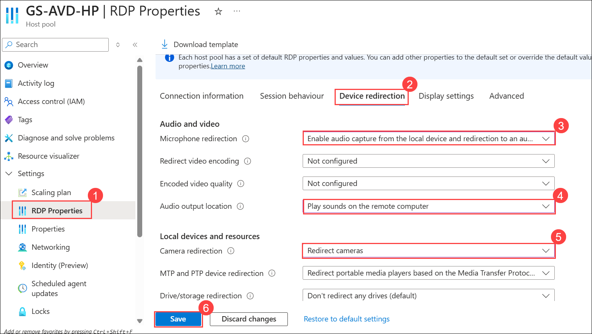
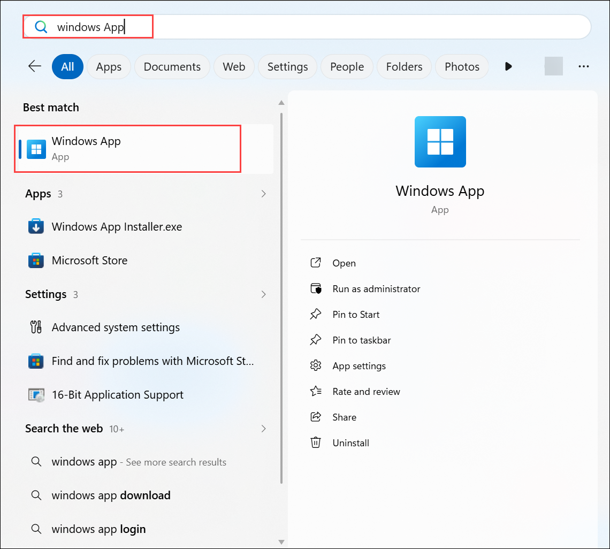
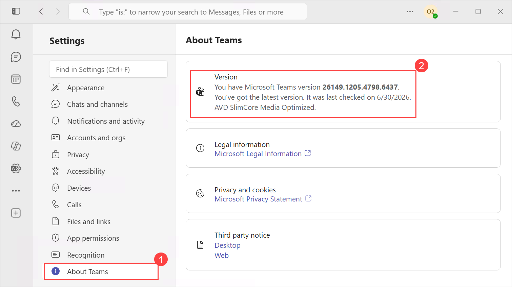
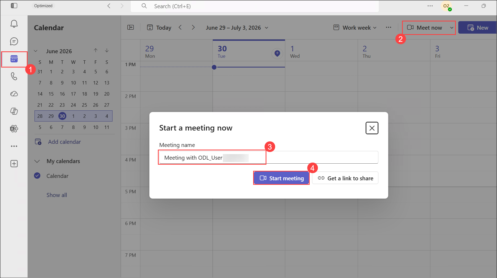

# Lab 10: Multimedia redirection for Azure virtual desktop

### Estimated Duration: 20 Minutes

## Lab Scenario

Contoso wants to enhance user experience and improve performance during virtual meetings. To achieve this, Contoso has decided to enable Multimedia Redirection (MMR) for Azure Virtual Desktop so that audio and video processing happens locally on the user's device. You will guide Contoso in configuring and validating Teams media optimizations on AVD.

In this lab, you will be implementing MS Teams for AVD. Microsoft Teams on Azure Virtual Desktop supports chat and collaboration. With media optimizations, it also supports calling and meeting functionality. With media optimization for Microsoft Teams, the Remote Desktop client handles audio and video locally for Teams calls and meetings.

## Lab Objective

In this lab, you will complete the following exercise:

- Exercise 1: Multimedia redirection for Azure virtual desktop

## Exercise 1: Multimedia redirection for Azure virtual desktop

In this exercise, you will configure Multimedia Redirection (MMR) for Azure Virtual Desktop, validate Teams media optimization, and test audio/video redirection by launching a Teams meeting inside the AVD session.

1. Navigate to the Azure portal, then search for **Azure Virtual Desktop (1)** in the search bar and select **Azure Virtual Desktop (2)** from the suggestions.

   
   
1. Select **Host pools (1)** from the side blade and select **GS-AVD-HP (2)**.

   
   
1. Under Settings, Select **RDP Properties** **(1)** and select **Device redirection** **(2)**. Select the following options.
   
   - Microphone redirection: Select **Enable audio capture from the local devices and redirection to an audio application in the remote session** **(3)** from the dropdown.
   - Audio output location: Select **Play sounds on the remote computer** **(4)** from the dropdown
   - Camera redirection: Select **Redirect cameras** **(5)** from the dropdown.
   - Leave the rest of the properties as **default**.
   - click on **Save** **(6)**.

      

1. On your PC, search for **Windows App** and open the remote desktop application with the exact icon as shown below.

   
   
1. The AVD desktop client will launch, then double-click on the SessionDesktop application to access it.

   
   
1. A window saying *Starting your app*, will appear. Wait for a few seconds, then enter your password to access the Application.

    - Password: **<inject key="AzureAdUserPassword"></inject>**

      

1. After the desktop loads, search for **PowerShell (1)**, then right-click **Windows PowerShell (2)** and select **Run as Administrator (3)**.

   

1. Enter the command below and press Enter to install and update the Teams application.

   ```
   winget upgrade --id Microsoft.Teams --source winget --silent --accept-package-agreements --accept-source-agreements
   ```
   > **Note**: If the **winget** command does not work in PowerShell, ignore the error and continue with the remaining steps in the lab.

1. After the desktop has loaded, search for **Teams (1)** and click **Open (2)**, as shown in the screenshot below.

   

1. You might see the popup stating Teams Need an Update then **Click on Open teams on web.** And login with  **<inject key="AzureAdUserEmail"></inject>**
    
    

      >**Note:** It will open Microsoft Teams in the Microsoft Edge browser and prompt you to sign in. Please enter your username and password to log in to Teams on the web browser.

1. In the Everyone together in Teams pane, click on **Sign in** as **<inject key="AzureAdUserEmail"></inject>**.

   
   
1. Enter password: **<inject key="AzureAdUserPassword"></inject>**

   

   >**Note:** After you log in to Microsoft Teams, if a pop-up appears showing “What’s New in Teams”, click on “Continue” and then select “Got it” to proceed.

   >**Note:** If you get **Let Microsoft Teams VDI Optimiser access your camera or microphone** pop ups, click on **Yes**

1. After the Teams application is launched, click on the **ellipsis(...)** **(1)** then, click on **Settings** **(2)**.

   

   >**Note:** If you receive any notification to restart Teams, click on the **Restart now** option.

      

1. Click on **About (1)** at the bottom. You will see a message stating **You have Microsoft Teams Version x.x.x, which is AVD SlimCore Media Optimized (2)**.

   
   
   >**Note**: If you see a message saying **AVD SlimCore Media not connected**. Please skip the step and continue with the lab.
   
1. Click on **Devices (1)** and explore the media devices connected to your local desktop **(2)**.

   
   
   >**Note**: If you are not able to select other audio devices. Please skip the step and continue with the lab.
   
1. Navigate to the **Calendar (1)** in the side panel. Click on **Meet now (2)**, keep the **Meeting name (3)** as default, and select **Start meeting (4)**.

   
   
1. Make sure both **Audio** **(1)**, and **Video** **(2)** are enabled. Click on **Join now** **(3)**.

   
   >**Note:** If a pop-up appears stating “To give you the best Teams experience on a virtual desktop, we need to restart the app,” simply click “Cancel” to dismiss 
   
   >**Note**: If the audio is not working. Please skip the step and continue with the lab as this is an expected issue.
  
1. If prompted, click on **Allow access** on the Windows Security alert prompt.

   

1. If the **Invite People to join you** prompt appears, close the tab and continue.     

1. Now, you should be able to see yourself as the video is On.

   

## Summary

In this lab, you enabled multimedia redirection in Azure Virtual Desktop and validated it by launching Microsoft Teams inside the AVD session to test audio, video, and device redirection.

Now, click on **Next** from the lower right corner to move on to the next page.

  


