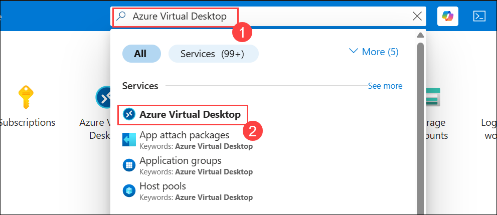
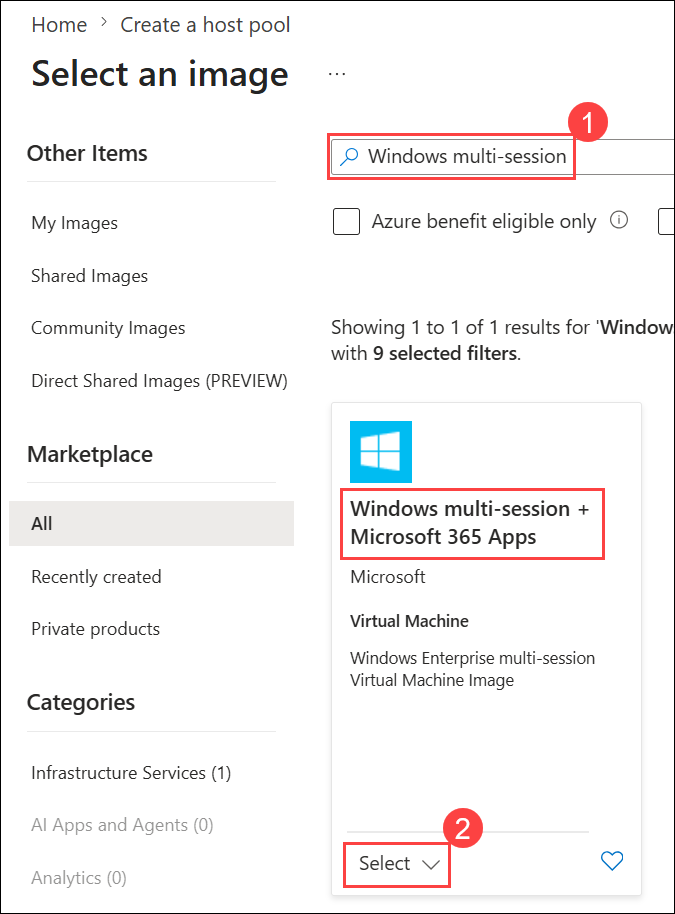
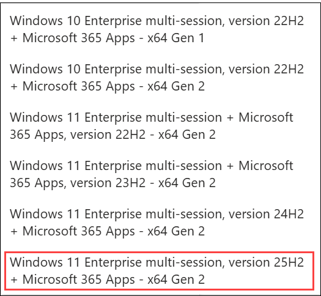
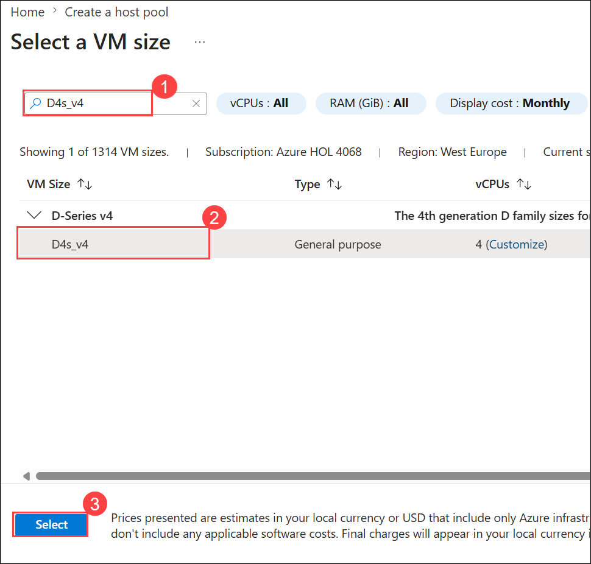
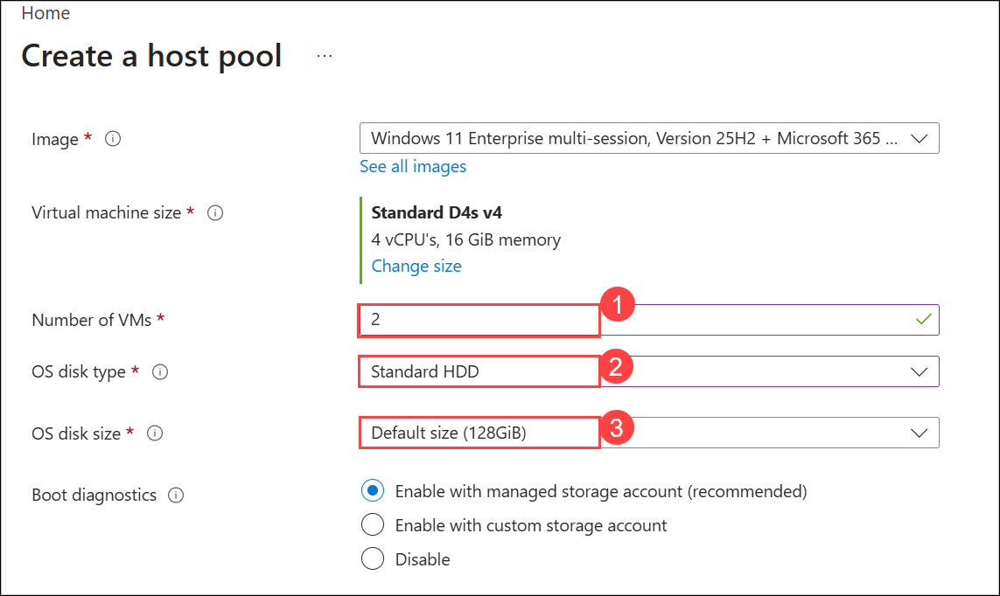
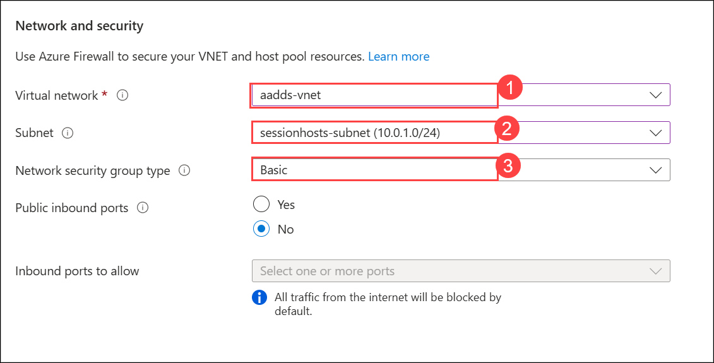

# Lab 14: Microsoft Entra ID Domain Join

### Estimated Duration: 20 Minutes

## Lab Scenario

Contoso is planning to set up its infrastructure on Azure. As a first step, Contoso needs you to provision a host pool, which is the main component of Azure Virtual Desktop (AVD). Creating the host pool also includes session hosts that are domain-joined through Microsoft Entra ID, a default application group, and a workspace.

A **Host Pool** is a collection of Azure virtual machines that register to Azure Virtual Desktop as session hosts when the Azure Virtual Desktop agent runs on them. All session host virtual machines in a host pool should be sourced from the same image, so that every user gets a consistent experience. To get started, you will first log in to the Azure portal.

## Lab Objective

In this lab, you will complete the following exercise:

- Exercise 1: Create a Host Pool using the Getting Started Wizard

## Exercise 1: Create a Host Pool using the Getting Started Wizard

In this exercise, you will create a host pool using the **Getting Started Wizard**, which lets you do this with minimum effort and information.

1. On the **Azure portal** search for **Azure Virtual Desktop** **(1)** in the **search bar** and select **Azure Virtual Desktop** **(2)** from the suggestions.

   

1. On the AVD **Overview page (1)**, click on **Create a host pool (2)**.

   

1. On the **Basics** tab, provide the following information and click **Next: Session hosts >** **(10)**.

   - Subscription: **Leave it as default (1)**
   - Resource Group: **Leave it as default (2)**
   - Host pool name: **AVD-AADJ-HP (3)**
   - Location: Select **<inject key="Region" enableCopy="false"/> (4)** from the drop-down list.
   - Validation environment: **Yes (5)**
   - Preferred app group type: **Desktop (6)**
   - Host pool type: **Pooled (7)**
   - Create Session Host Configuration: leave as default (**No**)
   - Load balancing algorithm: **Breadth-first (8)**
   - Max session limit: **5 (9)**

        

1. On the **Virtual Machines** tab, provide the following information :

   - Add virtual machines: **Yes (1)**
   - Resource Group prefix: Enter **AVD-HostPool-RG-avd (2)**
   - Name prefix: **AVD-AADJ-HP (3)**
   - Virtual machine type: **Azure virtual machine (4)**
   - Virtual machine location: Select **<inject key="Region" enableCopy="false"/> (5)** from the drop-down list.
   - Availability options: **No infrastructure redundancy required (6)**
   - Security type: **Standard (7)**

        

1. In the **Image** field, click on **See all images** to choose the required image.

   

1. In the search bar, search for **Windows multi-session (1)**, then under **Windows multi-session + Microsoft 365 Apps** choose **Select (2)**, and then select **Windows 11 Enterprise multi-session, Version 25H2 + Microsoft 365 Apps** *(choose from dropdown)*.

   
   

1. Virtual machine size: **Standard D4s v4**. Click on **Change size**, search for **D4s_v4 (1)**, select the **D4s_v4 (2)** row, and click **Select (3)** as shown below.

   

1. Provide the information as mentioned below:
   
   - Number of VMs: **2 (1)**
   - OS disk type: **Standard HDD (2)**
   - OS disk size: **Default size (128GiB) (3)**

      

1. On the **Network and security** section, enter the required information as follow:

   - Virtual Network: **aadds-vnet (1)** *(choose from dropdown)*
   - Subnet: **sessionhosts-subnet(10.0.1.0/24) (2)** *(choose from dropdown)*
   - Network security group type: **Basic (3)**

      

1. **Domain to join**

    - Select which directory you would like to join: **Microsoft Entra ID (1)**
    - Enroll VM with Intune: **No (2)**

        

1. **Virtual Machine Administrator account**

    - Username: **demouser (1)**
    - Password: **Password.1!! (2)**
    - Confirm password: **Password.1!!** **(3)**
    - Click on **Next: Workspace > (4)**

        

1. On the Workspace tab, provide the following information and click **Review + create (3)**:

    - Register desktop app group: **Yes (1)**
    - To this workspace: **GS-AVD-WS (2)**

        

1. Verify the information and click **Create**.

    

    > **NOTE:** Usually it takes 20 mins to get deployed successfully. Sometimes it might take up to 90 minutes.

1. Once the deployment is successful, click on **Go to resource**.

    

1. This takes you to the host pool that was just created. The following resources were created:

    - Host Pool: 1 (AVD-AADJ-HP)
    - Session Host: 2 (AVD-AADJ-SH-0, AVD-AADJ-SH-1)
    - Application Group: 1 (AVD-AADJ-HP-DAG)
    - Workspace: 1 (GS-AVD-WS)

        

## Summary

In this lab, you created an Azure Virtual Desktop host pool using the Getting Started Wizard, with session hosts domain-joined through Microsoft Entra ID. Along the way, you configured the host pool basics, provisioned session host virtual machines, selected the VM image and size, set up networking, configured the Microsoft Entra ID domain join and admin account, and registered a default application group and workspace.

Now, click on Next from the lower right corner to move on to the next page.

  