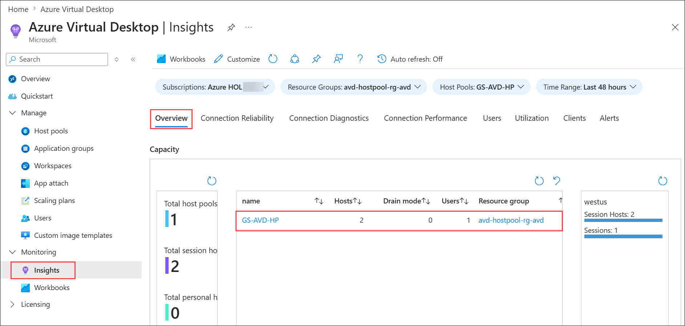
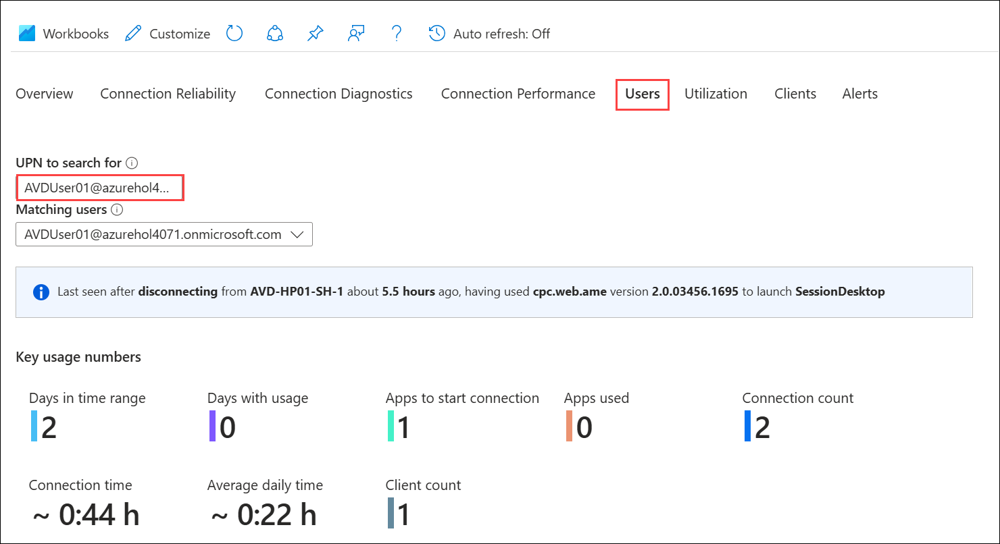
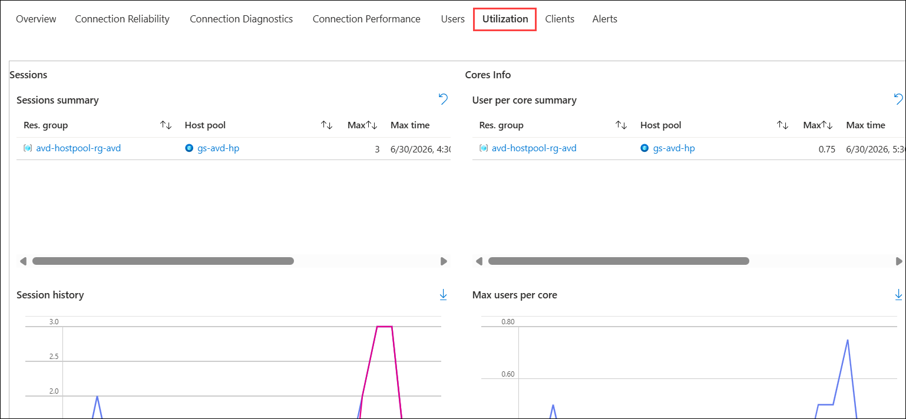
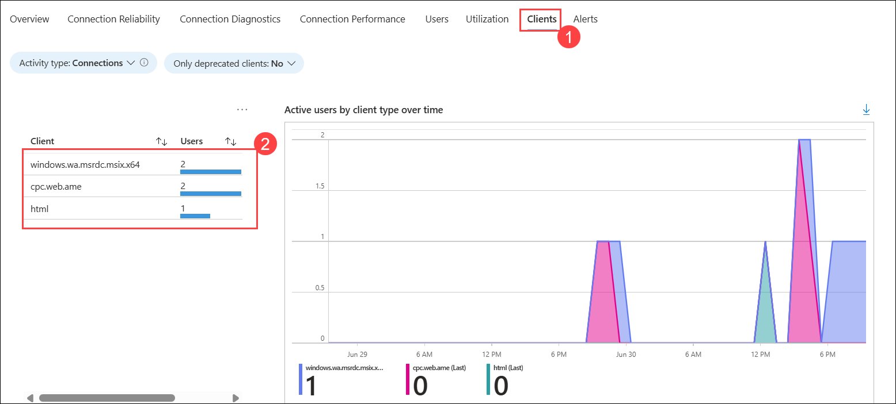

# Lab 2(B): Monitoring using Azure Monitor for AVD

### Estimated Duration: 20 Minutes

## Lab Scenario

Contoso wants to ensure the health, performance, and usage of their Azure Virtual Desktop environment is effectively monitored. To achieve this, they need you to explore and analyze AVD Insights data, including session host status, user activity, resource utilization, and client connections, to proactively manage and optimize their virtual desktop deployment.

In this lab, you will be reviewing monitoring data of the AVD environment using Azure Insights which you had configured in part A of Exercise 2.

## Exercise 1: Exploring Insights for AVD

### Task 1: Access AVD using the browser and Windows App

In this task, you will access the Azure Virtual Desktop environment using both the Windows App and browser, subscribe to the appropriate workspace, sign in with your credentials, and launch the Session Desktop to prepare for monitoring and management activities.
   
1. Navigate to **Your Own PC/computer/workstation**, go to **Start** search for **Windows App** and open the application with the exact icon as shown below.

   
   
1. Click on the **account icon** in the top-right corner, then select **Sign in with another account**.

   

   >**NOTE**: We need to switch accounts because in Exercise 4 you signed in with a different user.

1. Enter the user credentials to access the workspace.

   - Username: Paste the username  **<inject key="Avd User 02"></inject>** then click on **Next**.
   
   - Password: Paste the password  **<inject key="AVD User Password"></inject>** and click on **Sign in**.

      
       >**Note**: If MFA prompts, please follow the MFA steps provided.

1. In the AVD client, double-click on the **Session Desktop** to access it. 

   

1. Enter your **credentials** to access the application and click on **Submit**.

   > **Note:** If you are unable to sign in using the provided password, try logging in with the **AzurePassword** available in the **AzureCreds** file on the desktop.

   - Username: Paste the username  **<inject key="Avd User 02"></inject>** then click on **Next**.
   - Password: Paste the password **<inject key="AVD User Password"></inject>** and click on* **OK**.
   
     
  
1. The virtual Desktop will launch as shown below. 

   
   
   >**NOTE**: **DO NOT** close the session or the AVD Remote client. Keep it running.

### Task 2: Exploring Insights data

In this task, you will use Azure Virtual Desktop Insights to monitor your environment by reviewing the Overview for session host health, the Users tab for individual user activity, the Utilization tab for resource usage, and the Clients tab to see how users are connecting, gaining insights into the overall performance and usage of the AVD deployment.

>**NOTE**: While performing this exercise, you might see that data is not loaded as expected. In such a scenario, Please refresh the **Insights** page until the data is loaded.
   
1. Now, Navigate to Azure Virtual Desktop and select **Insights** under **Monitoring** blade in the Azure Portal.

   -ex2-step2.png)
   
1. In **Insights** page, click on **Overview** tab. Here you can see the **GS-AVD-HP** host pool. Scroll down,you will be able to monitor the connection diagnostics and performance and utilization of the session hosts.

   
   
1. Click on the **Users** tab. In **UPN to search for**, paste **<inject key="Avd User 01"></inject>** and wait for the data to load. This tab gives an overview of the user's usage. Scroll down and explore the different information loaded.

   
   
1. Click on the **Utilization** tab, This tab gives information about session summary, core info, and more information about the utilization of resources.

   
   
1. Click on **Clients** **(1)** tab, Here you'll be able to monitor the number of users **(2)** connected to AVD using the browser and remote client application.

   
   
1. Spend some time on the page to explore different monitoring abilities offered by Azure Insights.

## Summary

In this lab, you learned how to monitor an Azure Virtual Desktop (AVD) environment using Azure Monitor Insights.

### You have successfully completed the Hands-on Lab.

## Conclusion

By completing this **Azure Virtual Desktop (AVD)** hands-on lab, you have gained valuable, practical experience in deploying and managing a secure, scalable virtual desktop environment. Starting with creating host pools and configuring FSLogix profile containers, you learned to publish applications, assign access to users, and validate connectivity through both browser and desktop clients. You also explored monitoring and diagnostics with Log Analytics and Azure Monitor, optimized performance and costs through load balancing, auto-scaling, and Start VM on Connect, and implemented advanced security measures such as MFA, Conditional Access, AppLocker, and app masking. This comprehensive journey equips you with the knowledge and skills to confidently design, manage, and secure enterprise-grade virtual desktop solutions using Azure Virtual Desktop.
