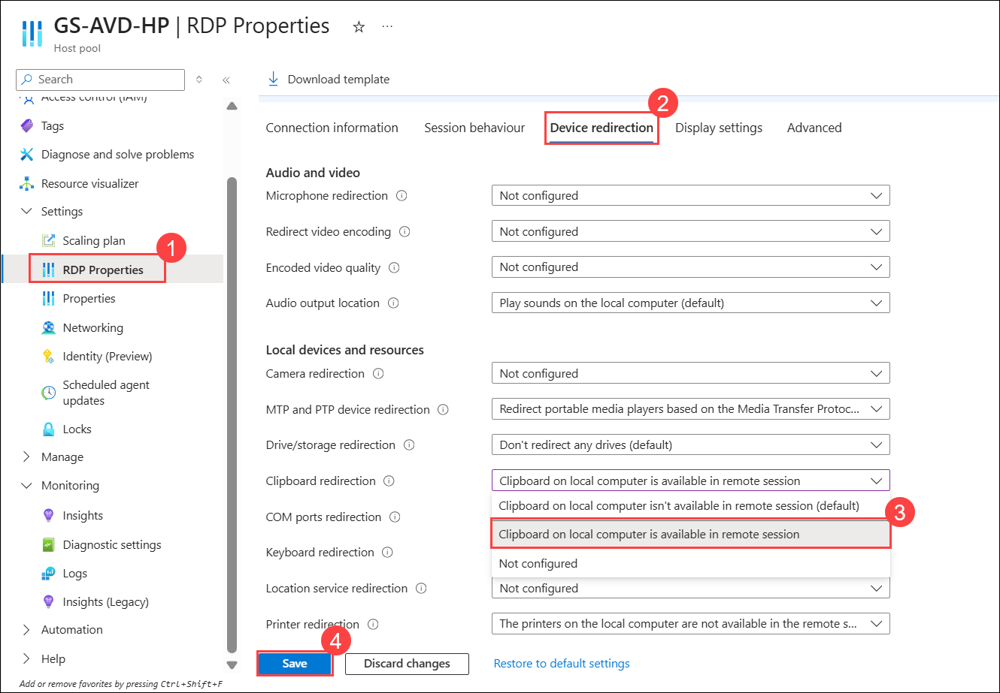
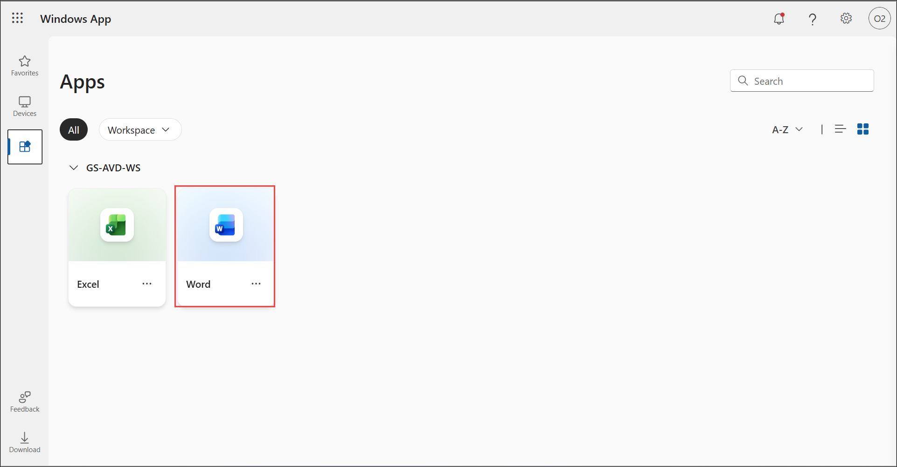
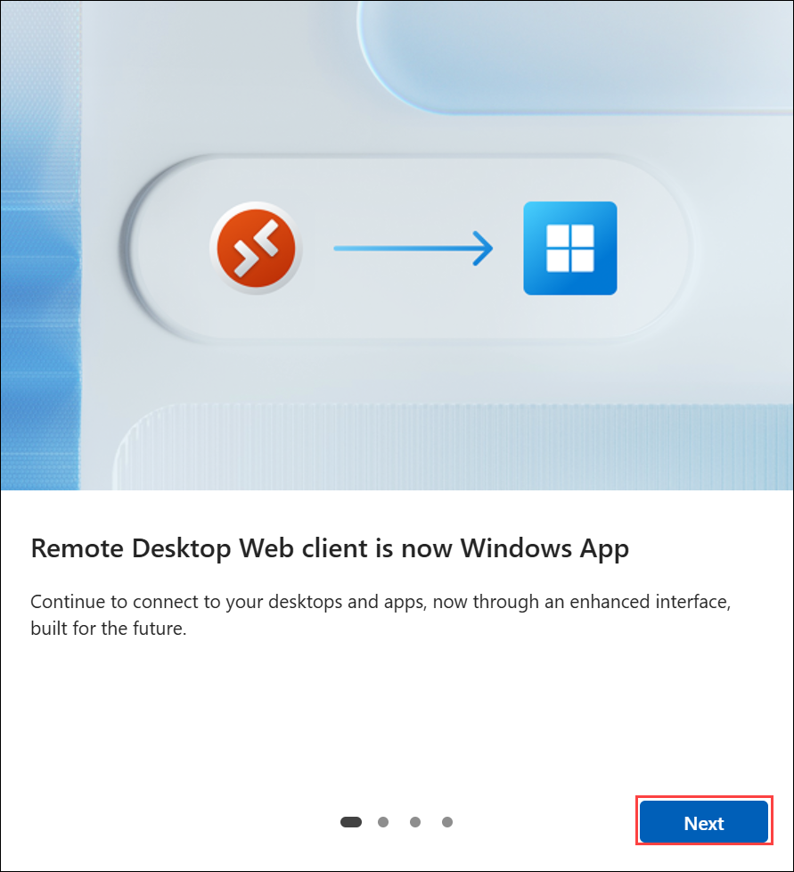
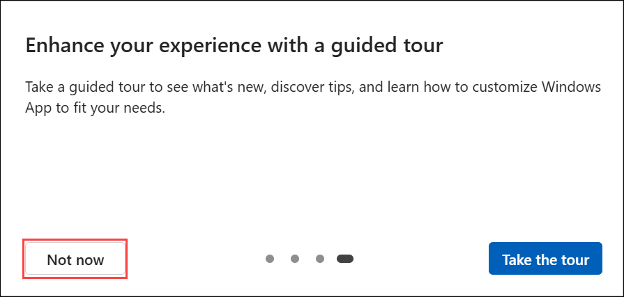
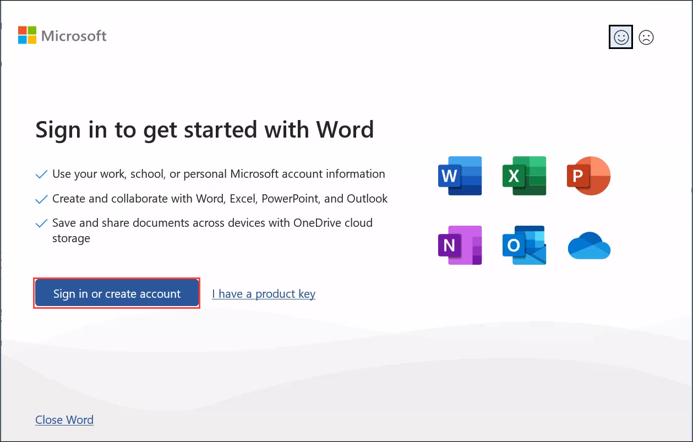
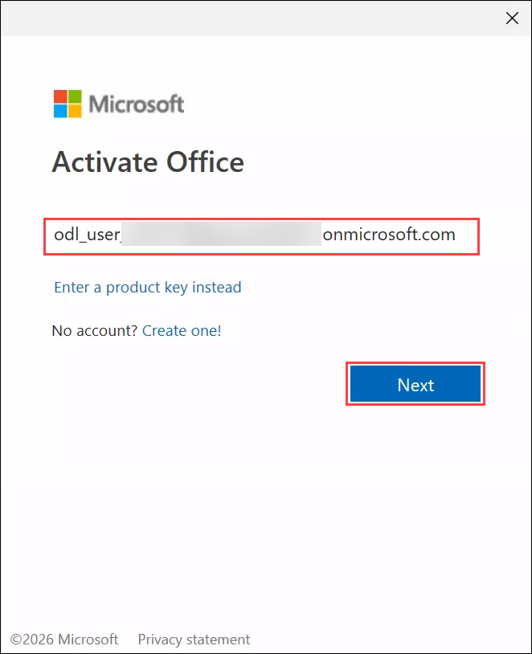
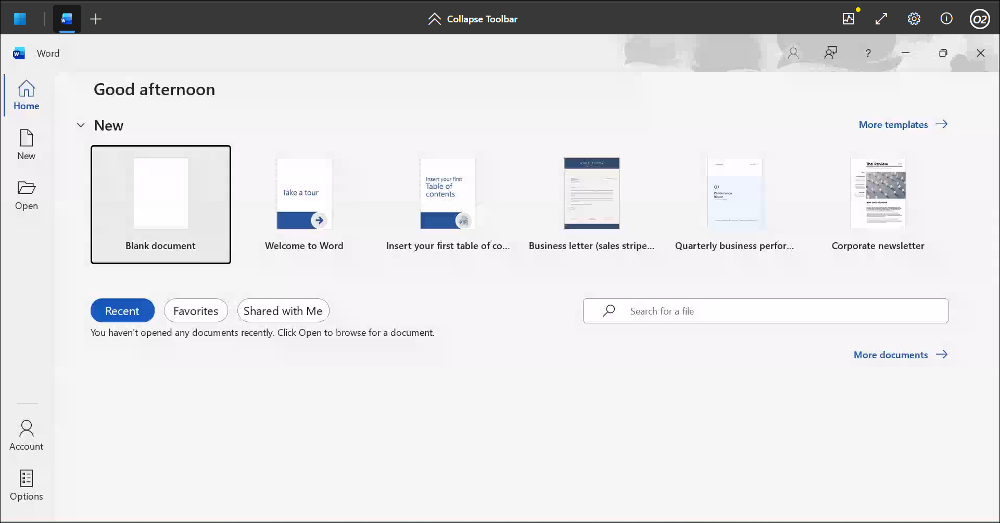
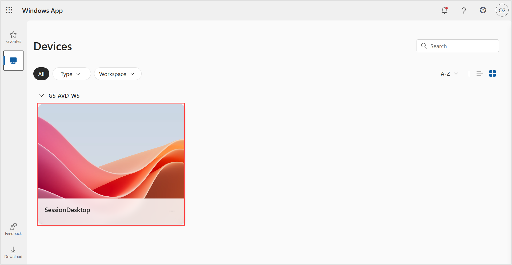
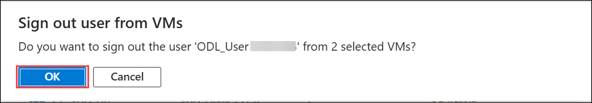

# Lab 4: Access the Published Applications and Desktop using Browser

### Estimated Duration: 40 Minutes

## Lab Scenario

Contoso wants to provide employees with flexible access to their Azure Virtual Desktop environment. In this lab you will help Contoso test access to Azure Virtual Desktop sessions using a browser. 


In this lab, you will access the Desktop and RemoteApps assigned to us in lab 3 using a browser. 


## Lab Objectives

In this lab, you will complete the following exercises:

- Exercise 1: Access the Published Application
- Exercise 2: Access the published Desktop

## Exercise 1: Access the Published Application

In this exercise, you will access the published RemoteApp application by configuring AVD settings, signing in through the Remote Desktop Web Client, and launching Word to verify successful application delivery.

1.  Navigate to Azure portal, then search for **Host pools (1)** in search bar and select **Host pools (2)** from the suggestions.

    

1. Navigate to **GS-AVD-HP**.

   

1. Then go to **RDP Properties (1)** under **Settings** blade. Under the **Device redirection (2)**, for the **Clipboard redirection** select the **Clipboard on local computer is available in remote session (3)** form the drop down and click **Save (4)**.

    

1. Navigate to **GS-AVD-HP**, then go to **Properties (1)** under **Settings** blade. Under the **Preferred app group type**, choose **RemoteApp (2)** and click **Save (3)**.

    

1. Open the following URL in a new browser tab in the JumpVM. This URL will lead us to the Remote Desktop Web Client.

   ``` 
   aka.ms/wvdarmweb 
   ``` 

   >**Note:**  If you are already logged in to your user account, jump to step 7 else continue with the next step i.e., Step 6.

1. To login, enter the lab credentials below:

   - Username: Paste your username **<inject key="AzureAdUserEmail"></inject>** and then click on **Next**.
   
      

   - Temporary Access Pass: Paste the password **<inject key="AzureAdUserPassword"></inject>** and click on **Sign in**.

      

1. The AVD dashboard will launch. Click on **Word** to access it.  

   

   >**Note:** The first time you connect, you may see one or both of the following introductory screens. On the **Remote Desktop Web client is now Windows App** screen, click **Next**, and on the **Enhance your experience with a guided tour** screen, click **Not now** to continue.
   >
   >
   >
   >

1. Select **Allow** on the prompt asking permission to **Access local resources**.

1. On the **In Session Settings** screen, leave **Clipboard** checked so that you can copy and paste between your local device and the session, then click **Connect**.

   

1. Enter the lab credentials to access the application and click on **Sign In**.

   > **Note:** If you are unable to sign in using the provided password, try logging in with the **AzurePassword** available in the **AzureCreds** file on the desktop.

   - Username: **<inject key="AzureAdUserEmail"></inject>** 
  
   - Password: **<inject key="AzureAdUserPassword"></inject>**

      
      
1. The Word application will launch and look similar to the screenshot below. Click on **Sign in or Create account**.

   
   
   >**Note:**  If you see a Blank Screen while launching the application, restart the AVD Session Hosts. To do so; follow the below steps:
   > - Navigate back to the Azure Portal and search for **Virtual Machines** from search bar.
   > - Select the two AVD VMs and then click on the **RESTART** button from the top ribbon menu.
   > - After a minute or two; once the AVD Session host VMs are restarted; try the step again.

1. Enter username **<inject key="AzureAdUserEmail"></inject>** on **Activate Office** window and click on **Next**.

   

   >**Note:** If you get a popup saying Move Text in and out of Remote Desktop, click on the **Don't show again** checkbox and then click on the **Got it button**.
   
   

1. Enter password **<inject key="AzureAdUserPassword"></inject>** and click on **Sign in**.

   

1. Click on the **Close** button on the window asking **Your privacy option**.

   

1. Once signed in, the application will look like the screenshot below.

   

## Exercise 2: Access the published Desktop

In this exercise, you will access the published AVD desktop by updating the host pool settings, launching the Session Desktop through the Remote Desktop Web Client, signing in with your lab credentials, and finally verifying and managing active user sessions from the Azure Virtual Desktop portal.

1.  Navigate to Azure portal, then search for **Host pools (1)** in search bar and select **Host pools (2)** from the suggestions.

    

1. Navigate to **GS-AVD-HP**, then go to **Properties (1)**. Under the **Preferred app group type**, choose **Desktop (2)** and click **Save (3)**.
   
      
    
   
1. Refresh the **Windows App Web Client** page.

1. Click on the tile named **Session Desktop** to launch the desktop.

   

1. On the **In Session Settings** screen, leave **Clipboard** checked so that you can copy and paste between your local device and the session, then click **Connect**.

   

1. Enter the lab credentials to access the application and click on **Sign In**.

   > **Note:** If you are unable to sign in using the provided password, try logging in with the **AzurePassword** available in the **AzureCreds** file on the desktop.

   - Username: **<inject key="AzureAdUserEmail"></inject>** 
  
   - Password: **<inject key="AzureAdUserPassword"></inject>**

      

1. The virtual desktop will launch and look similar to the screenshot below. 

   
   
   > **Note:** If you see a black screen while launching the session desktop, please re-start the session desktop by re-performing the lab from step 2.

1. Return back to the Azure Portal, search for **Azure virtual desktop(1)** in the search bar, and select **Azure Virtual Desktop(2)** from the suggestions.

   

1. Click on **Users (1)** under **Manage** blade, then paste **<inject key="AzureAdUserEmail"></inject> (2)** in the search bar and click on your user to open it **(3).**

    

1. Click on the **Sessions (1)** tab, select both Host pools by clicking on the checkbox **(2)** and then click on the **Sign out (3)** button.

    

1. Click on **OK** to **Sign out user from VMs**.

    

1. Click on the **Refresh** button and make sure **no results** are displayed under the Host pool.

   

## Summary

In this lab, you accessed both the published RemoteApp and the full AVD desktop by configuring the host pool settings, launching resources through the Remote Desktop Web Client, signing in with your lab credentials, and managing active user sessions from the Azure Virtual Desktop portal.

Now, click on the **Next** button present in the bottom-right corner of this lab guide.

 
