# Lab 5: Access the Published Applications and Desktop using the AVD Desktop Client

### Estimated Duration: 40 Minutes

## Lab Scenario

Contoso wants their AVD environment to be flexible in terms of accessing the sessions by their employees. You will help Contoso to test the access to the AVD session using the AVD Client application using your local computer.


In this lab, we will access the Desktop and WindowsApps assigned to us in the previous exercise using the AVD Desktop client.

## Lab objectives

In this lab, you will complete the following exercises:

- Exercise 1: Access the Published Applications
- Exercise 2: Access the Virtual Desktop

>**Note:** You have to perform this exercise in **Your Own PC/Computer/Workstation.** Do not perform this exercise within the JumpVM.

## Exercise 1: Access the Published Applications

In this exercise, you will install and configure the Remote Desktop client on your local PC, subscribe to your AVD workspace using your lab credentials, access the published RemoteApp (Excel), verify successful application launch, and finally manage and sign out your active AVD session from the Azure Virtual Desktop portal.

## Exercise 1: Access the Published Applications 

In this exercise, you will install the **Windows App** on your local computer, sign in using your lab credentials, subscribe to your Azure Virtual Desktop workspace, launch the published **Microsoft Excel** RemoteApp, verify that the application launches successfully, and then sign out of your active Azure Virtual Desktop session. 

1. On **your local computer** (not within the JumpVM), open a web browser, copy and paste the following URL into the address bar, and press **Enter**. 

   > **Note:** It is recommended to install and use the **Windows App** directly on your local computer instead of within the provided JumpVM. This provides a better user experience, improved performance, and a more reliable connection to your Azure Virtual Desktop resources.

   ```
   https://learn.microsoft.com/windows-app/get-started-connect-devices-desktops-apps
   ```

   > **Note:** To download *AVD Mac Client* on **macOS**, use the link given below:
   
   ```
   https://learn.microsoft.com/en-us/windows-app/get-started-connect-devices-desktops-apps?tabs=macos-avd%2Cwindows-w365%2Cwindows-devbox%2Cmacos-rds%2Cwindows-pc&pivots=azure-virtual-desktop
   ```

1. On the page that opens, scroll down until you see the **Connect to your devices and apps** section and click on **Windows App from the Microsoft store** Link.

   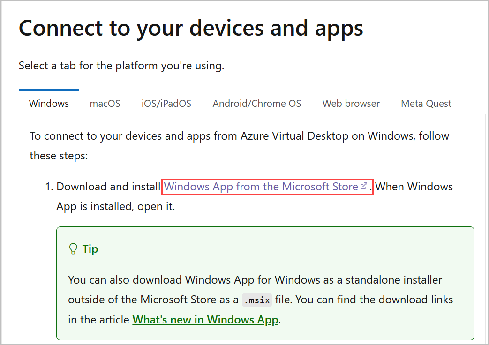

1. On the Windows App page in the Microsoft Store, click **Download** to download the Windows App installer to your local machine. Wait for the download to complete before proceeding to the next step.

   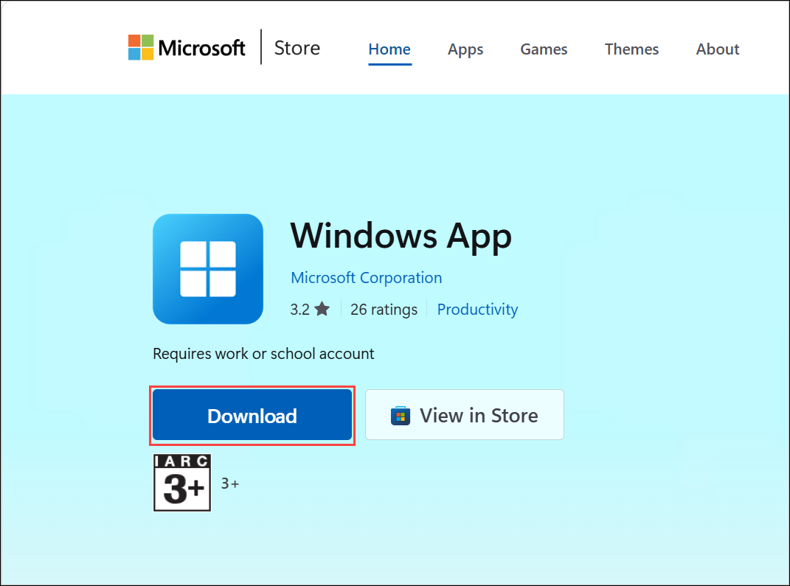

1. Once the download is complete, click **Open file** to launch the Windows App Installer and begin the installation process.

   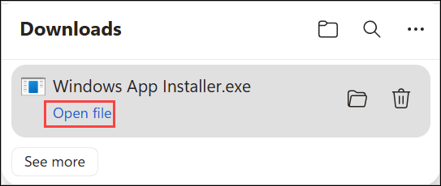
      
1. After the download completes, open the setup to run it. Then on the Welcome to Windows App page of setup click on **Next**.

   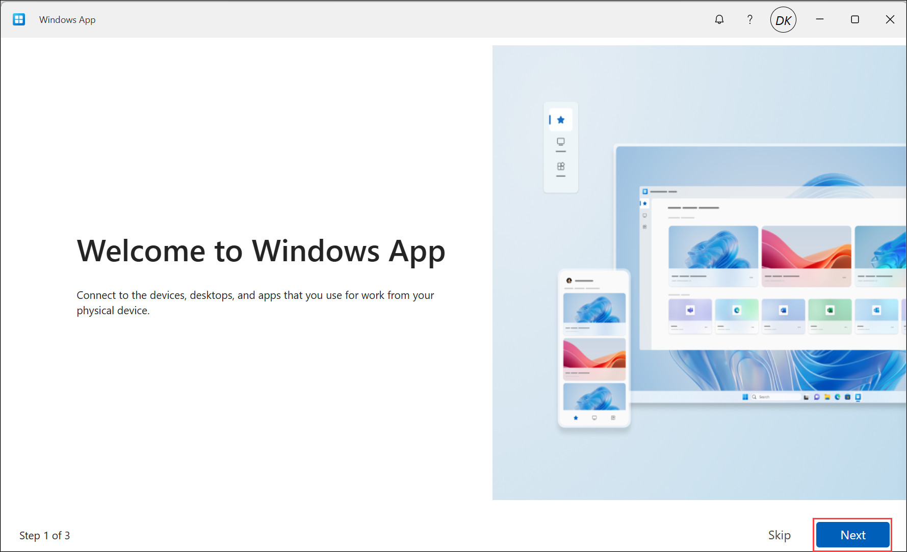

1. click on **Next** in the Windows App is built to provide security tab.

   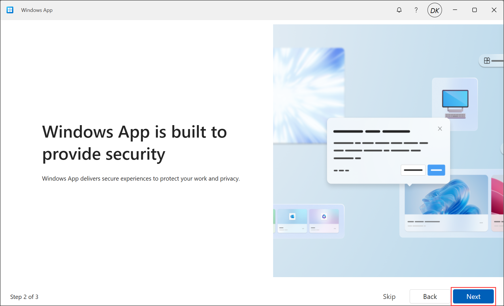

1. On the **shape windows App to suits you** page, select **Done** to complete the windows App setup.

   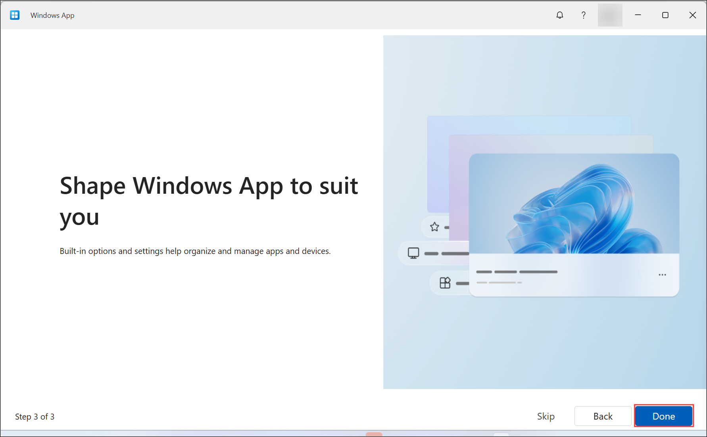

1. After setup is completed. On your PC go to **Start** and search for **Windows App** and open the remote desktop application with the exact icon as shown below.

   
   
1. Click on the **account icon** in the top-right corner, then select **Sign in with another account**.

   
  
1. Enter your **credentials** to access the workspace.
     >**Note**: If there is already an account signed in on your PC, click on + Use another account to authenticate using the user provided below.
   - Username: Paste your username **<inject key="AzureAdUserEmail"></inject>** and then click on **Next**.
   
      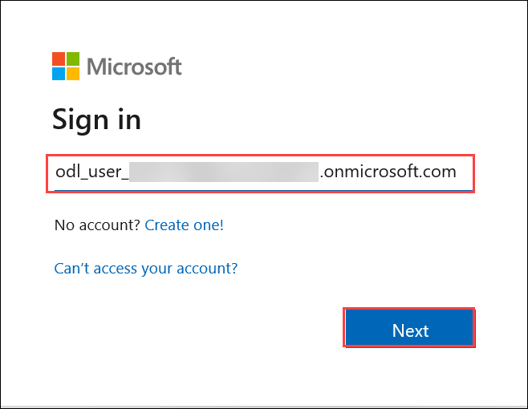

   - Password: Paste the password **<inject key="AzureAdUserPassword"></inject>** and click on **Sign in**.

      

1. Navigate to Azure portal, then search for **Host pools (1)** in search bar and select **Host pools (2)** from the suggestions.

   

1. Navigate to **GS-AVD-HP**, then go to **Properties (1)**. Under the **Preferred app group type**, choose **RemoteApp (2)** and click **Save (3)**.
   

   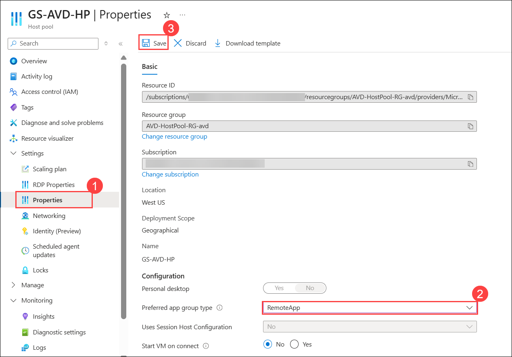

1. Return to your **PC Windows App application**, click on the **Refresh** in the top left corner.

   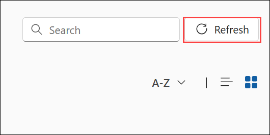
      
1. The AVD dashboard will launch, then double-click on the **Excel** application to access it.

   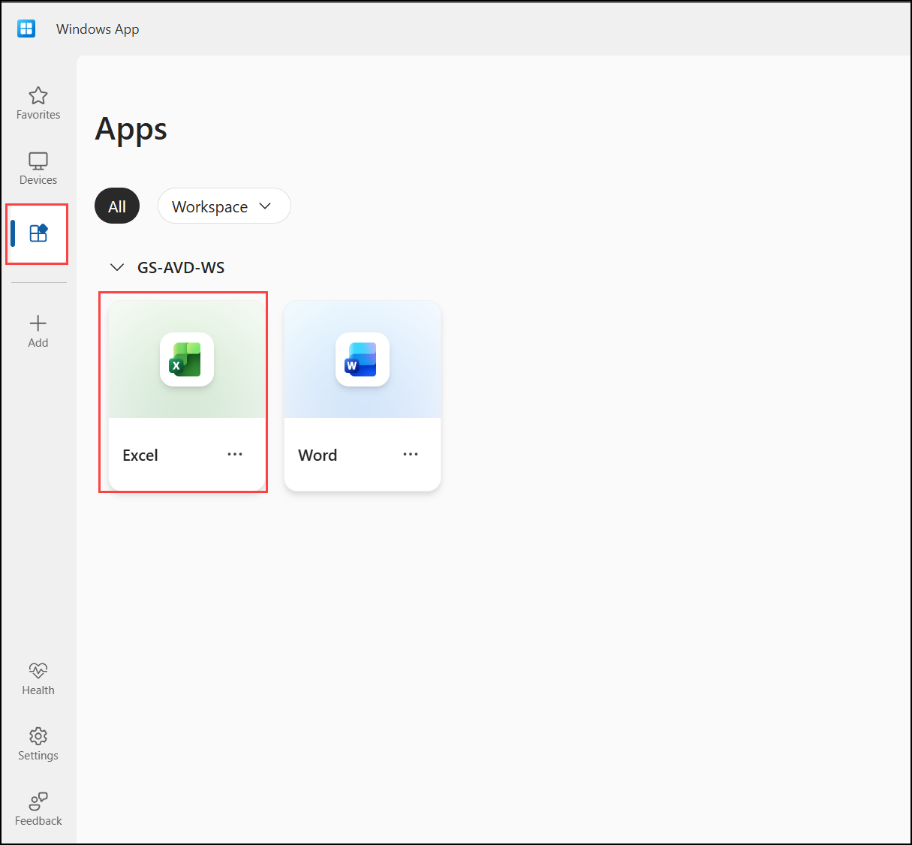
   
1. A window saying **Starting your app**, will appear. Wait for a few seconds, then enter your password to access the Application.

   > **Note:** If you are unable to sign in using the provided password, try logging in with the **AzurePassword** available in the **AzureCreds** file on the desktop.

    - Password: **<inject key="AzureAdUserPassword"></inject>**
   
      

1. Wait for the Application to connect.

   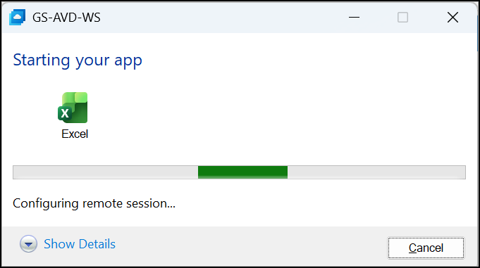
    
   >**Note:** If you get stuck while initiating the application, navigate back to the Azure portal restart the session host VMs and re-perform Exercise-1
   
1. The Excel application will launch and look similar to the screenshot below.

   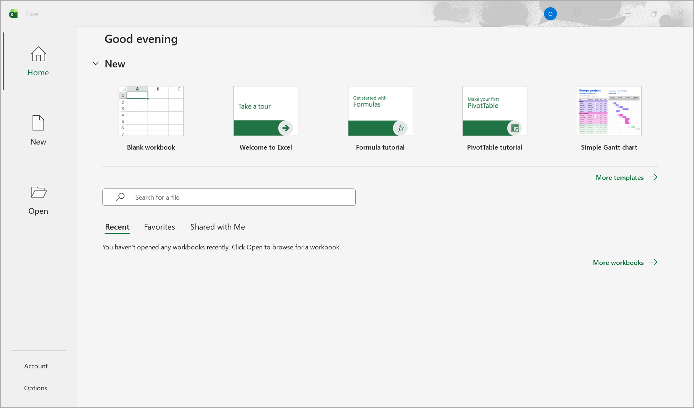 
    
1. You can exit from the window of the Excel Application by clicking on **X i.e., the close button**.

   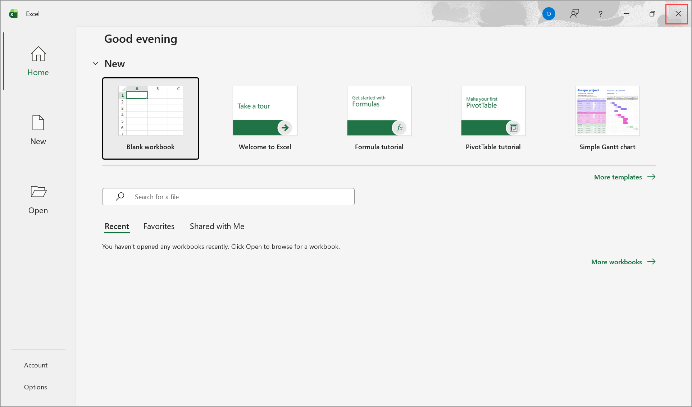

1. Return back to the Azure Portal, search for **Azure virtual desktop(1)** in the search bar, and select **Azure Virtual Desktop(2)** from the suggestions.

   

1. Click on **User (1)** under **Manage** blade, then Paste **<inject key="AzureAdUserEmail"></inject> (2)** in the search bar and click on your user to Open it **(3).**

   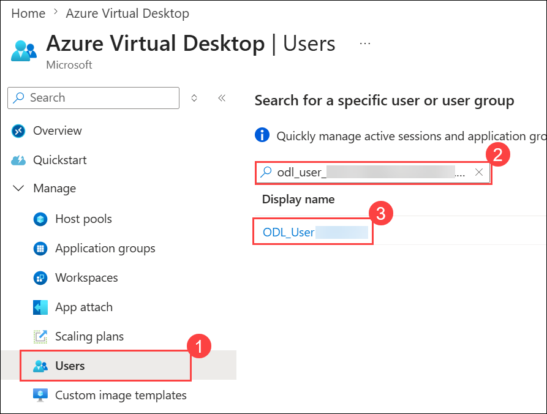

1. Click on the **Sessions (1)** tab, select the Host pool by clicking on the **Checkbox(2)** and then click on the **Sign out (3)** button.

    

1. Click on **OK** to **Sign out user from VMs**.

   

1. Click on the **Refresh** button and make sure **No results** is displayed under Host pool.

   
   
## Exercise 2: Access the Virtual Desktop

In this exercise, you will access the full AVD Session Desktop by updating the host pool settings, refreshing the Remote Desktop client, launching the virtual desktop, signing in with your credentials, and verifying successful desktop access.

1. Navigate to Azure portal, then search for **Host pools (1)** in search bar and select **Host pools (2)** from the suggestions.

   

1. Navigate to **GS-AVD-HP**, then go to **Properties (1)**. Under the **Preferred app group type**, choose **Desktop (2)** and click **Save (3)**.
   
    

1. Return to WVD client application then click on the **Refresh** in the top left corner.

   

1. Return to AVD client application. On the AVD dashboard, click on the tile named **Session Desktop** to launch the desktop.

   
   
1. A window saying **Connecting to: Session Desktop** will appear. Wait for a few seconds, then enter your password to access the Desktop.

   > **Note:** If you are unable to sign in using the provided password, try logging in with the **AzurePassword** available in the **AzureCreds** file on the desktop.

   - Password: **<inject key="AzureAdUserPassword"></inject>**
   
      
   
1. Wait for the Session Desktop to connect.

   

1. Your virtual desktop will launch and look similar to the screenshot below. You can exit from the window by clicking on **X i.e., the close button**. 
        
    

## Summary

In this lab, you installed and configured the Remote Desktop client on your local PC, subscribed to your AVD workspace, accessed the published RemoteApp (Excel), and managed your active session. You then updated the host pool settings to switch to a full desktop experience, launched the AVD Session Desktop through the Remote Desktop client, signed in with your lab credentials, and verified successful desktop access.
     
Now, click on **Next** from the lower right corner to move on to the next page.

  
