# Lab 7: Load Balancing methods

### Estimated Duration: 50 Minutes

## Lab Scenario

Contoso's AVD environment set-up is working smoothly. However, Contoso is confused about which load balancing to use in order to run the sessions efficiently. You will guide Contoso to explore different types of load balancing offered by Azure.

Azure Virtual Desktop supports two load-balancing methods. Each method determines which session host will host a user's session when they connect to a resource in a host pool.
While configuring a host pool, we can select load-balancing methods as per the needs.

The following load-balancing methods are available in Azure Virtual Desktop:

 **1. Breadth-first**: Breadth-first load balancing, distributes new user sessions across all available session hosts in the host pool. 

 **2. Depth-first**:  Depth-first load balancing, distributes new user sessions to an available session host with the highest number of connections but has not reached its maximum session limit threshold.

## Lab Objectives

In this lab, you will complete the following exercises:

- Exercise 1: Add new users to Microsoft Entra ID
- Exercise 2: Update Passwords for the new users
- Exercise 3: Change and experience Load Balancing methods


## Exercise 1: Add new users to Microsoft Entra ID

In this exercise, you will add new users to Microsoft Entra ID, assign them to the FSLogix permission group, and then assign the users to the appropriate Azure Virtual Desktop application group to grant access to published resources.

1. Navigate to the Azure portal, then search for **Microsoft Entra ID (1)** in the search bar and select **Microsoft Entra ID (2)** from the suggestions.

    

1. Click on **Users** under **Manage** blade.

   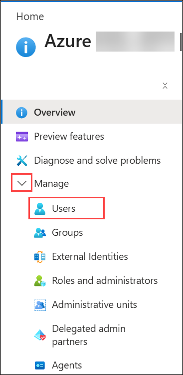

1. Click on **+ New user (1)** and select **Create new user (2)** from drop-down to add a new user.

   

   >**Note:** In some cases, the users might already be created. If you find that the users are already available, you can skip these steps and continue directly from the 8th point. Please recheck whether the membership is assigned; if it is assigned, continue from the 8th point, otherwise perform the steps below.

1. Add the following configurations under the *Basics* tab and leave the rest to default:

   - User principal name: **AVDUser01 (1)**
   - Display Name: **AVDUser01 (2)**
   - Copy the **Password (3)** and paste it in notepad
   - Click on **Review + Create (4)** and then click on **Create.**

        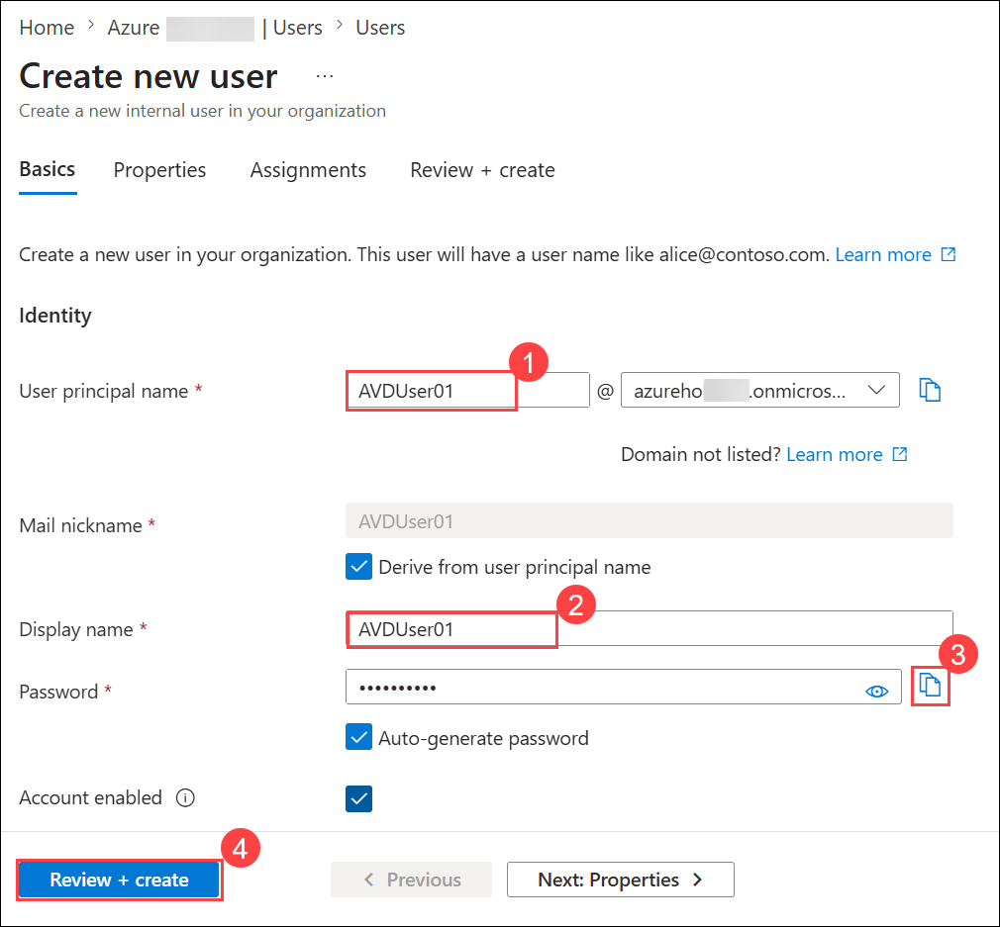

1. Click on **+ New user** and select **Create new user** to add one more user, then add the following configurations under *Basics* tab and leave the rest to default.

   - User principal name: **AVDUser02 (1)**
   - Display Name: **AVDUser02 (2)**
   - Copy the **Password (3)** and paste it in notepad
   - Click on **Review + Create (4)** and then click on **Create.**
   
        

1. Both the newly created users will show up similarly as shown below. Copy the **user principal name** of both users and paste it into a text editor so that we can use it further.

   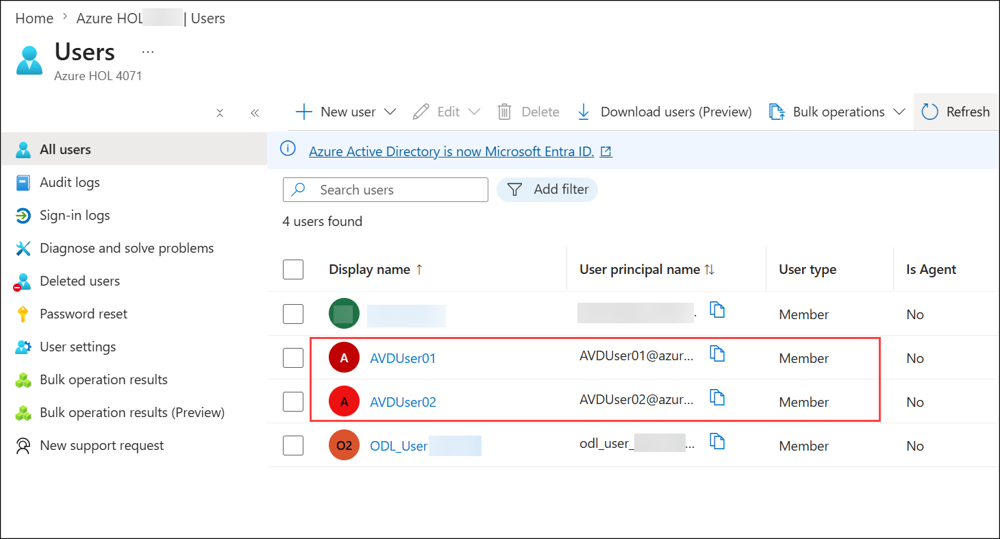

1. Click on **AVDUser01** to open it. Then click on **Groups** **(1)** and select **+ Add memberships** **(2)**.

   

1. Click on the **permission - fslogixcontainer (1)** group and then click on **Select (2)**.

   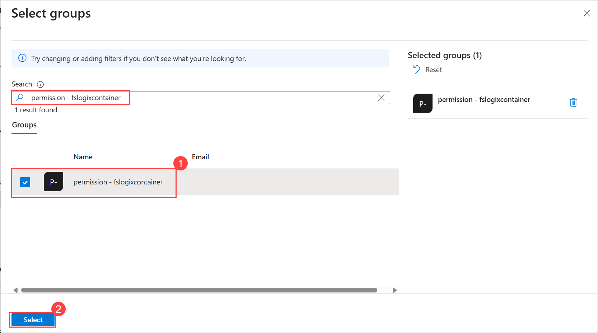

1. Go back to the users. Then click on **AVDUser02** to open it. Then click on **Groups** **(1)** and select **+ Add memberships** **(2)**.

   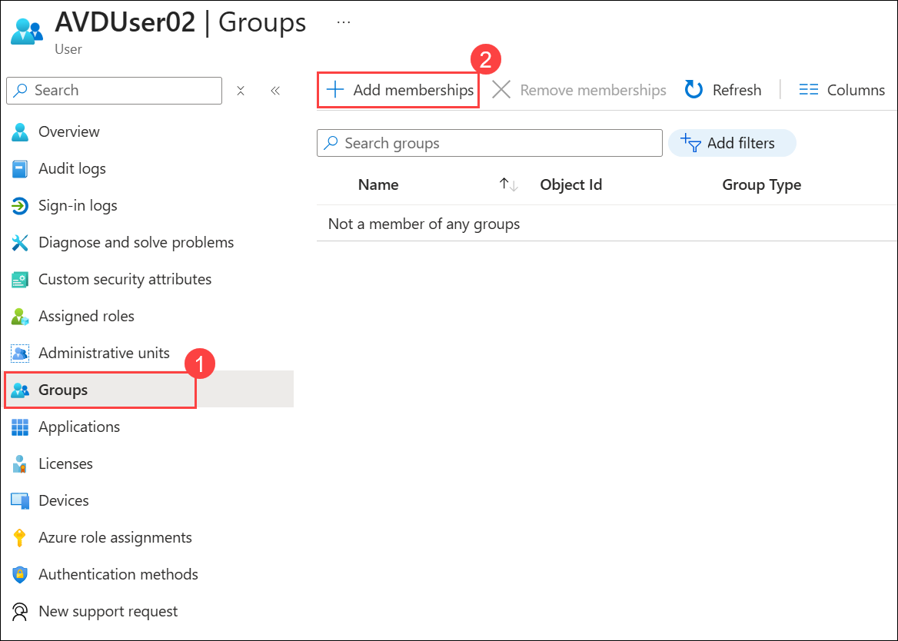

1. Click on the **permission - fslogixcontainer (1)** group and then click on **Select (2)**.

   

1. Search for **Host pools (1)** in search bar and select **Host pools (2)** from the suggestions.

   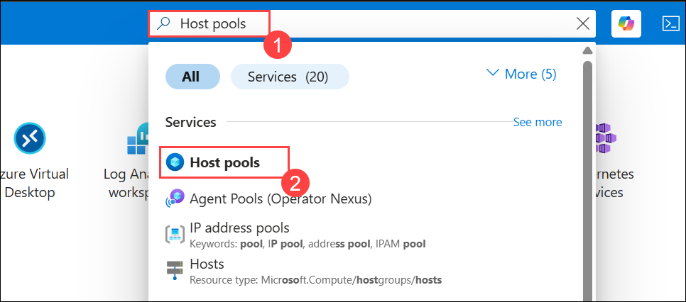

1. Select **GS-AVD-HP** and open **Application groups** present under **Manage** blade. **Two application groups** will be listed there.

    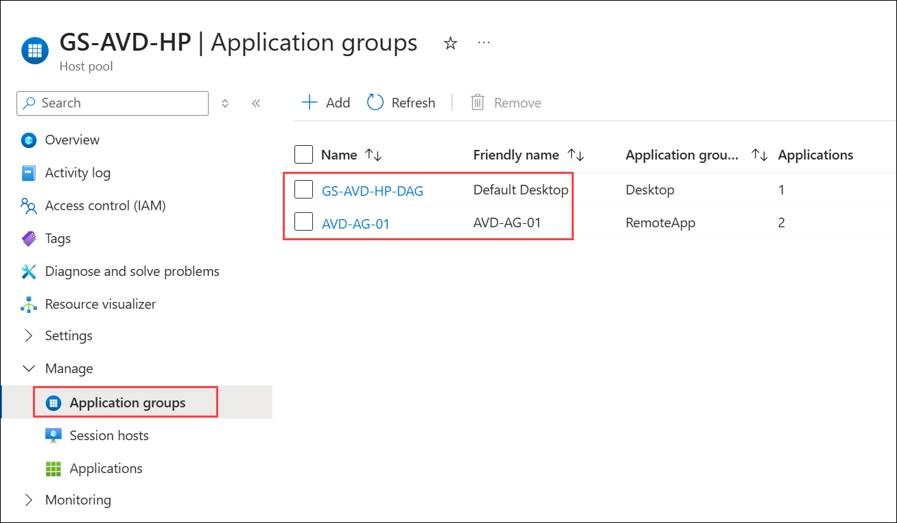

1. Open application group **GS-AVD-HP-DAG** and click on **Assignments** under *Manage* blade.

    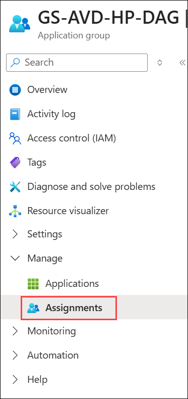
   
1. Click on **Assignments(1)** then click on **+ Add (2)**, then in the search bar, type **AVD** and select both **AVDUser01 & AVDUser02 (3)** that we created earlier. At last, click on the **Select (4)** button.

    

1. Once done, the users assigned to the Application group will look similar to the image given below.

    

   > **Congratulations** on completing the task! Now, it's time to validate it. Here are the steps:
   - Scroll down and hit the Validate button in the lab guide for the corresponding task. If you receive a success message, you can proceed to the next task.
   - If not, carefully read the error message and retry the step, following the instructions in the lab guide.
   - If you need any assistance, please contact us at cloudlabs-support@spektrasystems.com. We are available 24/7 to help you out.

   <validation step="05f24cd8-407f-425c-aaf6-bf0f3e9992d2" />

## Exercise 2: Update Passwords for the new users

In this exercise, you will use PowerShell to run a script that resets the passwords for the newly created users, ensuring they can log in successfully after registering with Azure AD DS.

1. Inside the Jump VM, click on the Windows button look for **PowerShell (1)** and click on **Windows PowerShell (2)**.

   

1. Copy and paste the following script and hit **Enter**.

   ```
   Get-AzADDomainService
   $domain = Get-AzADDomainService
   $domain = $domain.Name
   $PasswordProfile = @{
   Password = 'Azure1234567'
   ForceChangePasswordNextSignIn = $False
   }
   $users = @("AVDUser01@$domain","AVDUser02@$domain")
   $users
   $users | foreach{
   Update-AzADUser -UserPrincipalName $_ -PasswordPolicy DisablePasswordExpiration -PasswordProfile $PasswordProfile
   }
   ```
 
1. The output of the script will be similar to the one shown below. The password for both **AVDUser01** and **AVDUser02** is reset to **Azure1234567**.

    

     

   >**Note**: ***Username*** and ***Password*** for ***AVDUser01*** and ***AVDUser02*** is present in Environment Details tab.

   > **Congratulations** on completing the task! Now, it's time to validate it. Here are the steps:
   - If you receive a success message, you can proceed to the next task.
   - If not, carefully read the error message and retry the step, following the instructions in the lab guide.
   - If you need any assistance, please contact us at cloudlabs-support@spektrasystems.com. We are available 24/7 to help you out.

   <validation step="b5b843b1-12f4-483f-b19d-9a50b296c691" />

## Exercise 3: Change and experience Load Balancing methods

**A**. **Breadth-first**

While creating the GS-AVD-HP host pool, we selected the load balancing method as **Breadth-first**. Now, we are going to log in to the Desktop App created on GS-AVD-HP with both users simultaneously and see the user distribution.

1. Open an **Incognito browser** on the **JumpVM**, paste the provided link, and log in using your **credentials**.

   ```
   aka.ms/wvdarmweb
   ```

   - Username: Paste the username  **<inject key="Avd User 01"></inject>** then click on **Next**.
   
      

   - Password:  Paste the password **<inject key="AVD User Password"></inject> (1)** and click on **Sign in (2)**.

      

1. If you see the **Action Required** pop up, click on **Ask later.**

   >**Note:** If there's a dialog box saying **Stay signed in**, then select the **No** option.

     

     >**Note:** Follow the below steps, if MFA prompted:

     - Click **Next** in **Lets keep your account secure**.
     - On **Install Microsoft Authenticator**, click **Next**.

       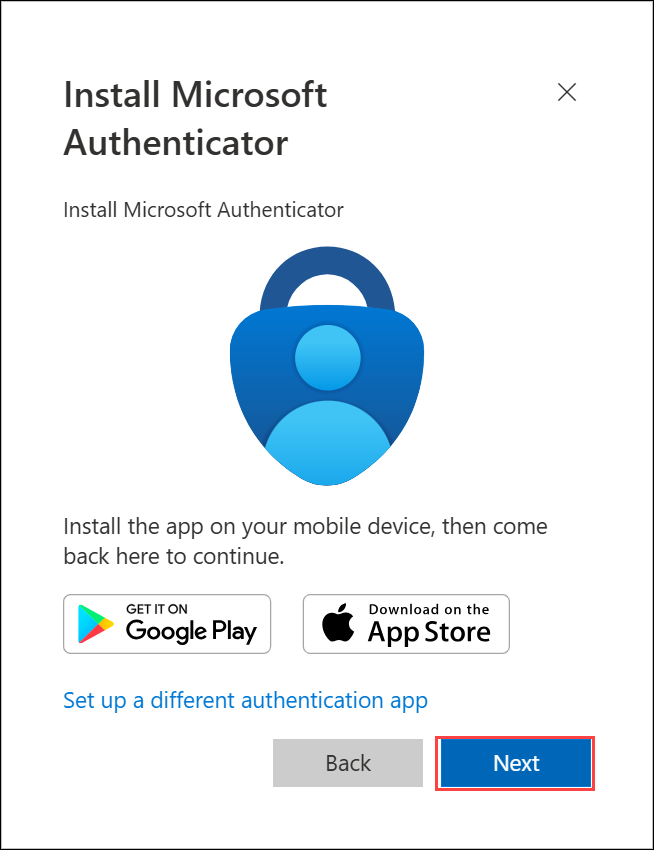   

     - Click **Next**.

       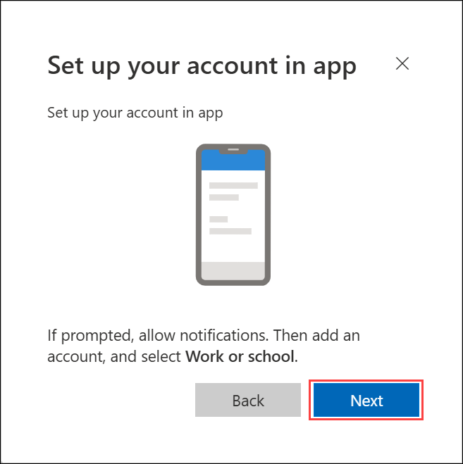   

     - In **android**, go to the play store and Search for **Microsoft Authenticator** and Tap on **Install**.      

       

        >Note: For iOS, open the App Store and repeat the steps.

        >Note: Skip if already installed.       

     - Open the app and tap on **Scan a QR code**.

     - Scan the QR code visible on the screen **(1)** and click on **Next (2)**.

       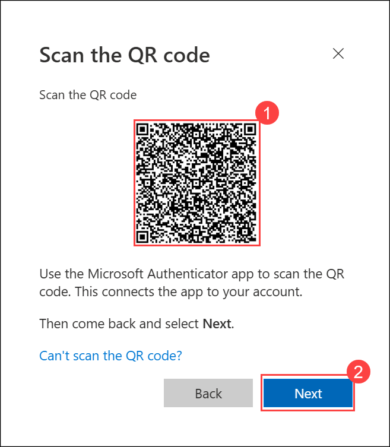

     - Enter the digit displayed on the Screen in the Authenticator app on your mobile and tap on **Yes**.

            

     - Once the notification is approved, click on **Next**.

     - Click on **Done**.

             

1. If prompted to stay signed in, you can click **"No"**.

   

1. Tap on **Finish** in the Mobile Device.

   > NOTE: While logging in again, enter the digits displayed on the screen in the **Authenticator app** and click on Yes.

1. Now in the AVD dashboard, click on the **Session Desktop** to access it. 

   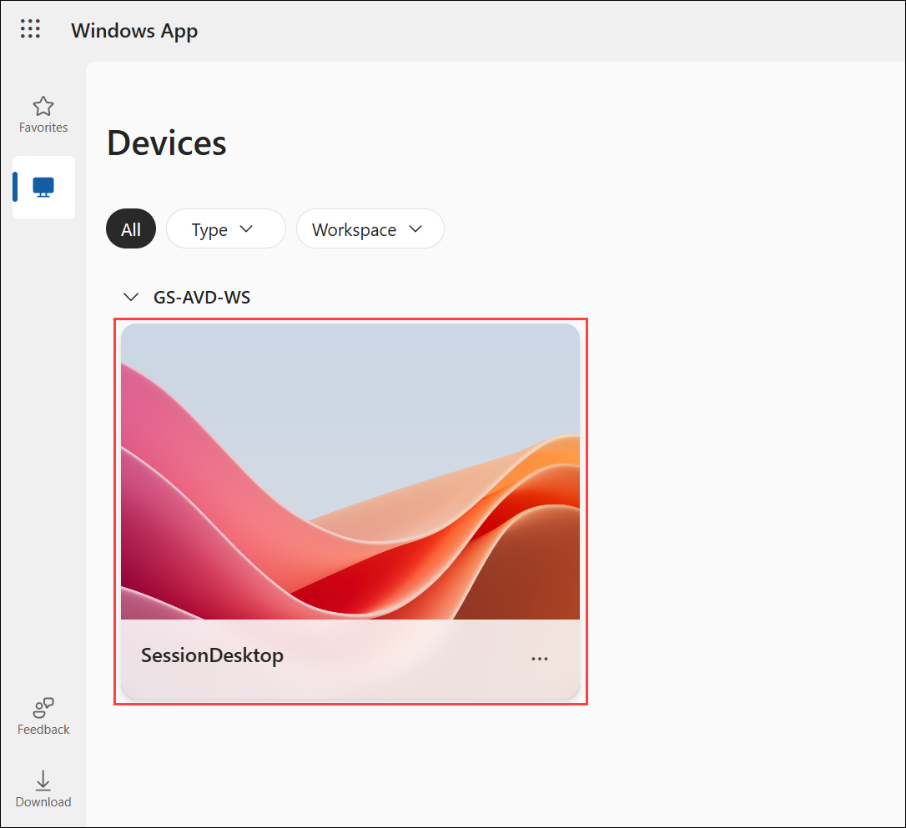

1. Select **Allow** on the prompt asking permission to **Access local resources**.

1. On the **In Session Settings** screen, leave **Clipboard** checked so that you can copy and paste between your local device and the session, then click **Connect**.

    

1. Enter your **credentials** to access the application and click on **Submit**.

   - Username: Paste the username **<inject key="Avd User 01"></inject>** .

   - Password: Paste the password  **<inject key="AVD User Password"></inject>** and click on **Submit**.

      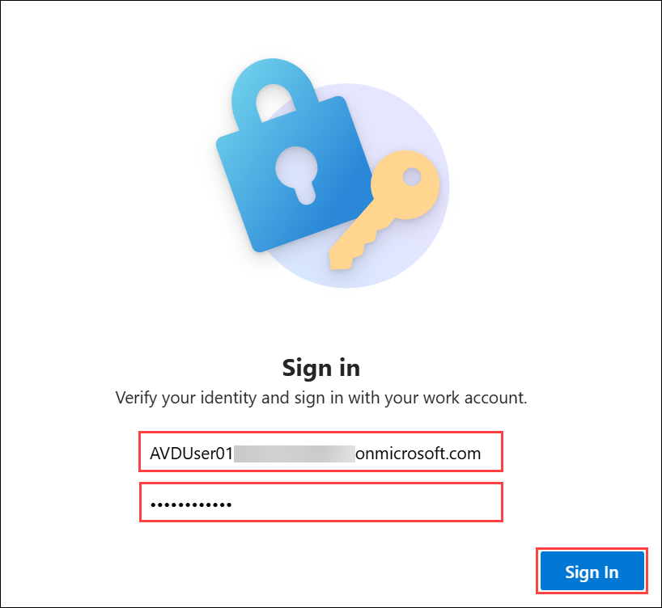

1. The virtual Desktop will launch as shown below. 

    

1. Navigate to **Your Own PC/computer/workstation**, go to **Start** search for **Windows App** and open the application with the exact icon as shown below.

    

1. Click on the **account icon** in the top-right corner, then select **Sign in with another account**.

    

      >**Note:** We need to unsubscribe from the feed because in Exercise 4 we subscribed to the AVD feed using a different user.

1. Enter the user credentials to access the workspace.

   - Username: Paste the username **<inject key="Avd User 02"></inject>** *then click on* **Next**.
   - Password: Paste the password **<inject key="AVD User Password"></inject> (1)** and click on **Sign in (2)**.

      

      >**Note**: If MFA prompts, please follow the MFA steps provided.

1. If you see the **Action Required** pop up, click on **Ask later.**

   >**Note:** If there's a dialog box saying **Stay signed in**, then select the **No** option.

   

1. In the AVD client, double-click on the **Session Desktop** to access it. 

     

1. Select **Allow** on the prompt asking permission to *Access local resources*.

1. On the **In Session Settings** screen, leave **Clipboard** checked so that you can copy and paste between your local device and the session, then click **Connect**.

    

1. Enter your **credentials** to access the application and click on **Submit**.

   - Password: Paste the password **<inject key="AVD User Password"></inject> (1)** and click on **OK (2)**.

      

1. The virtual Desktop will launch as shown below. 

      

1. Return to the Azure portal in your browser inside the **JumpVM**, search for **Host pools (1)** and click on **Host pools (2)** from the suggestion to open it.

     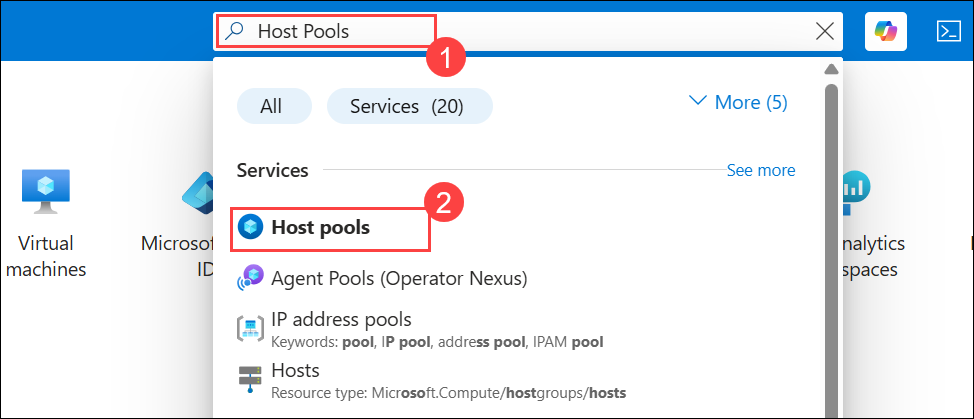

1. Now click on **GS-AVD-HP** host pool to access it.

     

1. Under Manage Blade, click on **Session hosts**.

     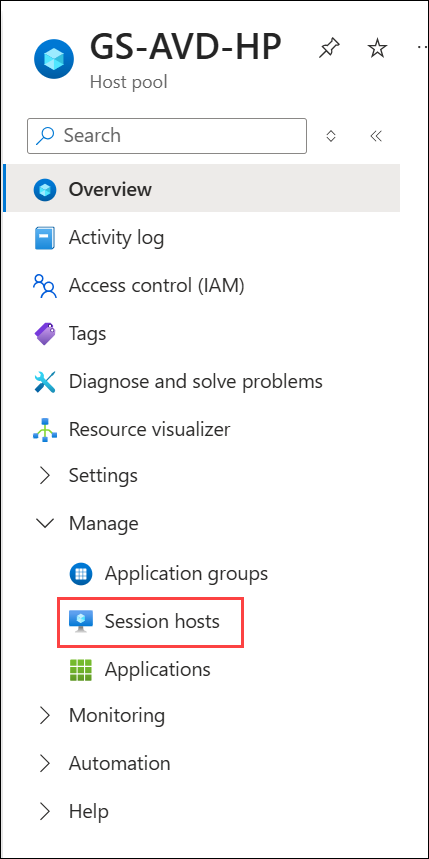

1. You can see that both session hosts have one Active session each.

     

      >**Note:** This shows how users are distributed among different session hosts, under the *Breadth-first load balancing method*. The breadth-first method first queries session hosts that allow new connections. The method then selects a session host randomly from half the set of session hosts with the least number of sessions. 

      >**Note** Please follow [Breadth-first Load-Balancing Method](https://docs.microsoft.com/en-us/azure/virtual-desktop/host-pool-load-balancing#breadth-first-load-balancing-method) to learn more about it.

1. Open the **AVD-HP01-SH-0....** session host and click on **Users (1)**, you can see the user logged in to that session host. Now select the user **(2)** and click on the **sign out users (3)** button and select **Sign out (4)** to the prompt asking **This will Sign out selected users from session host AVD-HP01-SH-0**.

     

1. Navigate back to **Session hosts** and open **AVD-HP01-SH-1...** session host, click on **Users (1)** and you can see the user logged in to that session host. Now select the user **(2)** and click on the **Sign out users (3)** button and select **Sign out (4)** to the prompt asking *This will Sign out selected users from session host AVD-HP01-SH-1*.

     

     >**Note:** We need to log off the users from session hosts so that when users log in again, the connection is made based on the **Depth-first load balancing method**.

**B**. **Depth-first**

   Here, we will change the load balancing method of the **GS-AVD-HP** host pool to *Depth-first* and see how user distribution changes in the Host pool.

   >**Note:** If the previous session is closed, visit `aka.ms/wvdarmweb`, then click on *Default Desktop* and log in with *AVDUser01* credentials.

1. In **GS-AVD-HP** host pool, click on **Properties** under **Settings** blade.

     

1. From Properties in the left menu, change the load balancing algorithm to **Depth-first (1)** then click on **Save icon (2)**.

     

1. Paste the below-mentioned link in your **Private browser**, in the **JumpVM** and enter your **credentials** to log in. 

   ```
   aka.ms/wvdarmweb 
   ```
   
1. If the session desktop is disconnected, close the tab and perform the next step.

1. In the AVD dashboard, click on the **Session Desktop** to access it. 

     

1. Select **Allow** on the prompt asking permission to *Access local resources*.

1. On the **In Session Settings** screen, leave **Clipboard** checked so that you can copy and paste between your local device and the session, then click **Connect**.

     

1. Enter your **credentials** to access the application and click on **Submit**.

    >**Note:** If it’s not connecting, please wait for about 5 minutes and then try opening the Remote app again using a private/incognito browser window. 

    - Username: Paste the username  **<inject key="Avd User 01"></inject>** then click on **Next**.

    - Password: Paste the password **<inject key="AVD User Password"></inject>**.

      

1. The virtual Desktop will launch as shown below. 

     

1. Navigate to **Your Own PC/computer/workstation**, go to **Start** search for **Windows App** and open the application with the exact icon as shown below.

     

1. In the AVD client, double-click on the **Session Desktop** to access it. 

     

1. Enter your **credentials** to access the application and click on **Submit**.

   > **Note:** If you are unable to sign in using the provided password, try logging in with the **AzurePassword** available in the **AzureCreds** file on the desktop.

   - Username: Paste the username **<inject key="Avd User 02"></inject>** *then click on **Next**.*
   - Password: Paste the password **<inject key="AVD User Password"></inject>** *and click on **OK**.* 

      

1. The virtual Desktop will launch as shown below.

      

1. Return back to the Azure portal in the **JumpVM**, navigate to **GS-AVD-HP** host pool and open **Session Hosts** present under **Manage** blade.

     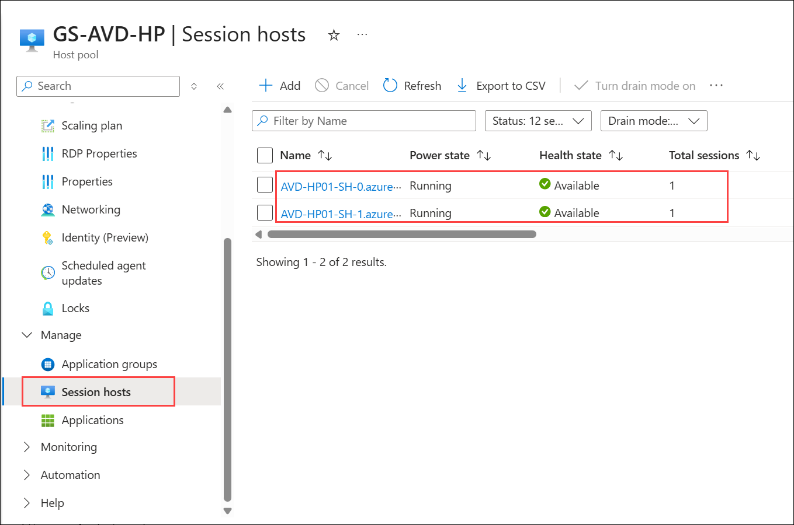

1. Here one of the session hosts, either **AVD-HP01-SH-0** or **AVD-HP01-SH-1** will have 2 Active sessions. Click on that session host to open it.

      

   >**Note:** Within one of the hosts, you might see a session count of 3,this is because one is a disconnected session by the ODL user, and the other two are active sessions.

   >**Note:** The depth-first method first queries session hosts that allow new connections and haven't gone over their maximum session limit. The method then selects the session host with the highest number of sessions. If there's a tie, the method selects the first session host in the query.

   >**Note** Please follow [Depth-first Load-Balancing Method](https://docs.microsoft.com/en-us/azure/virtual-desktop/host-pool-load-balancing#depth-first-load-balancing-method) to learn more about it.

1. Click on **Users** and verify that both users have been assigned to the particular session host. 

      

## Summary

In this lab, you added new users to Microsoft Entra ID, assigned them to FSLogix groups, and granted access to the appropriate AVD application groups. You then used PowerShell to reset their passwords for Azure AD DS login and explored Azure Virtual Desktop load-balancing methods, observing how Breadth-first and Depth-first algorithms distribute user sessions across hosts.

Now, click on **Next** from the lower right corner to move on to the next page.

  
