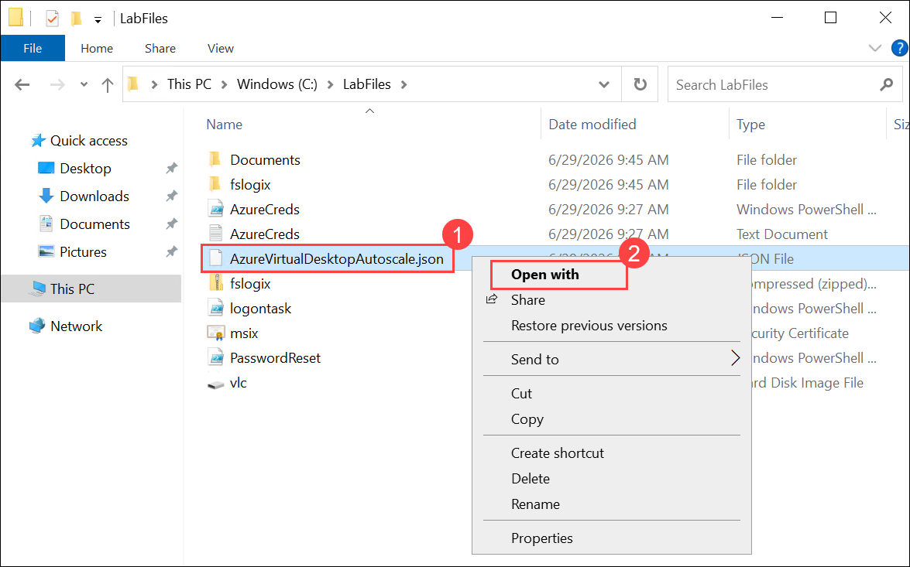
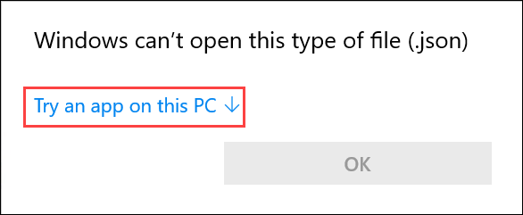
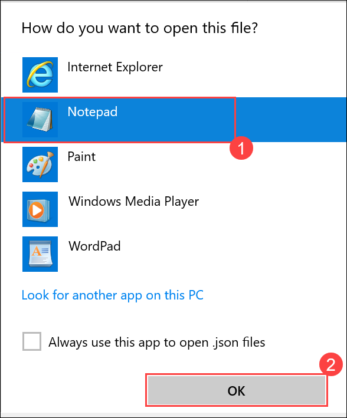
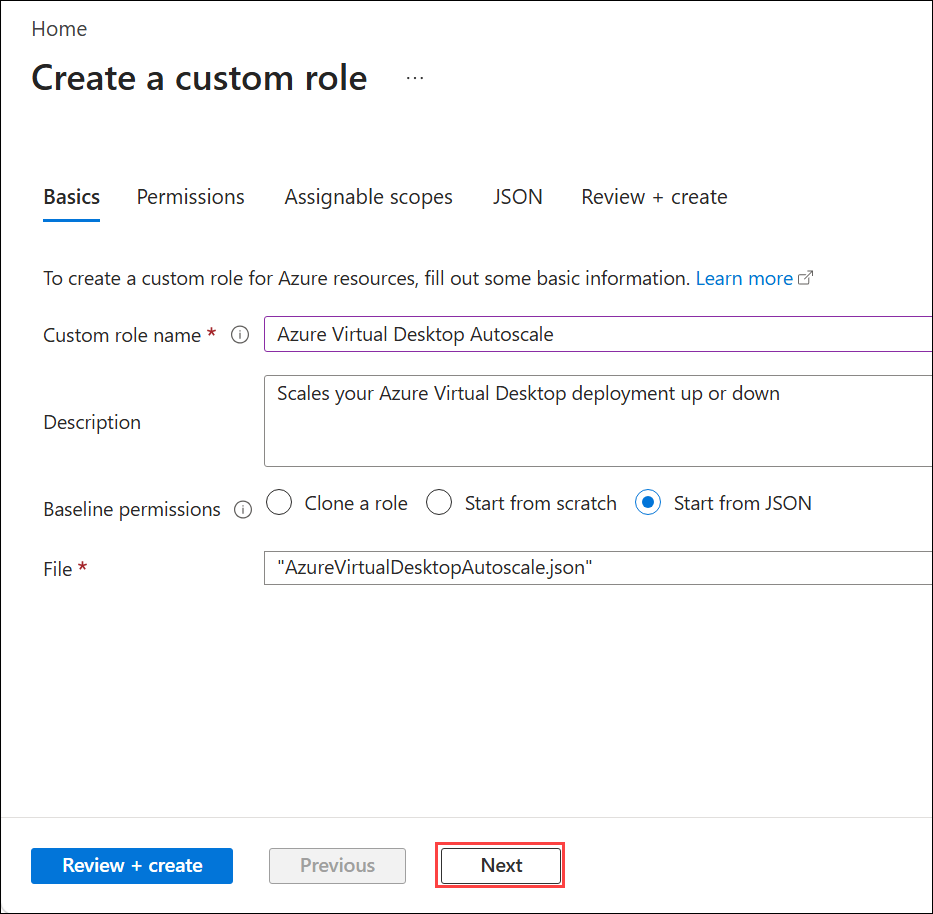
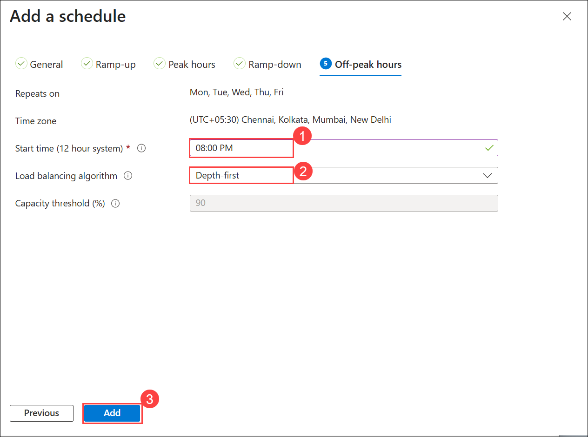

# Lab 8: Auto Scaling

### Estimated Duration: 40 Minutes

### Lab Scenario

Contoso wants to optimize the cost and efficiency of their Azure Virtual Desktop environment. To achieve this, they need you to configure an Autoscale scaling plan for their host pool, defining schedules, load-balancing algorithms, and ramp-up/ramp-down rules to automatically scale session host VMs based on user demand.

Azure Virtual Desktop uses Autoscale which let's scale your session virtual machines (VMs) in a host pool up or down to optimize deployment costs. You can create a scaling plan based on:

   - Time of day
   - Specific days of the week
   - Session limits per session host

## Lab Objective

In this lab, you will complete the following exercise:

- Exercise 1: Create a Scaling Plan

## Exercise 1: Create a Scaling Plan

In this exercise, you will create an Azure Virtual Desktop scaling plan by first assigning the necessary custom role to manage autoscaling, then configuring schedules for ramp-up, peak, ramp-down, and off-peak hours, setting load-balancing algorithms, defining host capacity thresholds, and finally assigning the plan to the target host pool to automatically scale session host VMs based on demand.

1. In the Azure Portal, search for **Subscriptions (1)** and select it from the search result **(2)**.

   
    
2. Select your **Subscription** from **Subscriptions** page.

   
   
3. Now select **Access Control (IAM) (1)** and click on **+ Add (2)** then select **Add custom role (3)**.

   
    
4. On the **Basics** tab, follow the below instructions:

    - Custom role name:  Enter **Azure Virtual Desktop Autoscale (1)**
    - Baseline permissions : Select **Start from JSON (2)**
    - Click on **Folder icon (3)** to select the JSON file.

        
     
5. Navigate to the path **C:\LabFiles**, right click on **AzureVirtualDesktopAutoscale.json (1)** and click on **Open with (2)**.

    
    
 6. If you get a pop-out stating **Windows can't open this type of file**, click on **Try an app on this PC**.

    
    
7. Choose **Notepad (1)** from the list and click on **OK (2)**.

    
    
8. In the JSON file, replace the subscription ID with **<inject key="Subscription Name"></inject>** and save the changes by clicking on **File (1) -> Save (2).**

           

           
        
9. After saving the changes, close the file and click on **Open** on the File Explorer.

    
    
10. On the **Basics** tab, click on **Next**.

    
    
11. On the **Permissions** tab, review the permissions you have assigned using the JSON file and click on **Review + create**.

     
     
12. Review the configurations, click on **Create** and followed by **Ok**.

    

    

     >**Note:** If you encounter an error while creating the custom role indicating that a role with the same name already exists, you can skip the custom role creation steps and proceed directly to step 19

13. Now select **Access Control (IAM) (1)** and click on **+ Add (2)** then select **Add role assignment (3)**.

    
   
14. On **Add Role Assignment** page, search for **Azure Virtual Desktop Autoscale (1)** and select it **(2)** , then click on **Next (3)**.

    
   
     >**Note:** If you don't find the role, wait for 2-3 min and re-perform the above step.
   
15. Under **Members** tab, click on **+ Select members**.

    
   
16. On **Select members (1)** tab, search for **Azure Virtual Desktop (2)** and select it then click on **Select (3)**.

    
        
17. After adding members, review the configuration and click on **Review + assign**.

    

18. In Review + assign tab, click on **Review + assign**.

    

19. From the Azure Portal menu, search for **Azure Virtual Desktop (1)** and select it.

    
   
20. On the **Azure Virtual Desktop** page, click on **Scaling plans (1)** under **Manage** blade and select **Create (2)**.

    
   
21. On the **Basics** tab of **Create a scaling plan** page, enter the below instructions:

    - Subscription: Leave it to **default (1)**
    - Resource group: Select **AVD-HostPool-RG-avd (2)**
    - Scaling plan name: Enter **AVD-SP-01 (3)**
    - Location: Select **<inject key="Region" enableCopy="false" />** from the drop-down list **(4)**
    - Friendly name: Enter **AVD-SP-01 (5)**
    - Time zone: Select your **Time Zone (6)**
    - Host pool type: **Pooled (7)**
    - Scaling method: **Power Management Autoscaling (8)**
    - Click on **Next : Schedules > (9)**

        

        
      
22. On the **Schedules** tab, click on **+ Add Schedule**

    
   
23. On the **General** tab of **Add a schedule** page, observe the values and leave everything as default, then click on **Next**.

    
   
24. On the **Ramp-up** tab, follow the below instructions:

    - Start time (12 hour system): Enter your **Start time (1)**
    - Load Balancing Algorithm: Choose **Breadth-first (2)**
    - Minimum percentage of hosts (%): **20 (3)**
    - Capacity threshold (%): **60 (4)**
    
    - Click on **Next (5)**
    
      
   
25. On the **Peak hours** tab, follow the below instructions:

    - Start time (12 hour system): Enter your **Start time (1)**
    - Load Balancing Algorithm: Choose **Depth-first (2)**
    - Click on **Next (3)**
    
        
   
26. On the **Ramp-down** tab, follow the below instructions:

     - Start time (12 hour system): Enter your **Start time (1)**
     - Load Balancing Algorithm: Choose **Depth-first (2)**
     - Minimum percentage of active hosts (%): Enter **10 (3)**
     - Capacity threshold (%): **90 (4)**
     - Force logoff users: Choose **Yes (5)**
     - Delay time before logging out users and shutting down VMs (min): Enter **30 (6)**
     - Click on **Next (7)**

        
   
27. On the **Off-peak hours** tab, follow the below instructions:

     - Start time (12 hour system): Enter your **Start time (1)**
     - Load Balancing Algorithm: Choose **Depth-first (2)**
     - Click on **Add (3)**

        
  
28. After adding the schedule, click on **Next: Host pool assignments >**

     
    
29. On **Host pool assignments** tab, select **GS-AVD-HP (1)** from the drop-down and click on **Review + create (2)**.

     
     
30. Review the changes and click on **Create**.

     
     
31. After the successful deployment, click on **Go to resource**.

     
 
32. Now you will navigate to the **Overview** page of the Scaling Plan **AVD-SP-01**.

     
     
     
      >**[Optional]**
      >
      >**Scale session hosts using Azure Automation**
      >
      >Here, you will learn about the scaling tool built with the Azure Automation account and Azure Logic App that automatically scales session host VMs in your Azure Virtual Desktop environment. 
      >
      > Please follow the link given below to learn more about this feature. [Scale session hosts using Azure Automation ](https://docs.microsoft.com/en-us/azure/virtual-desktop/set-up-scaling-script)

> **Congratulations** on completing the task! Now, it's time to validate it. Here are the steps:
- Scroll down and hit the Validate button in the lab guide for the corresponding task. If you receive a success message, you can proceed to the next task.
- If not, carefully read the error message and retry the step, following the instructions in the lab guide.
- If you need any assistance, please contact us at cloudlabs-support@spektrasystems.com. We are available 24/7 to help you out.

<validation step="521c23b6-77da-4da7-a165-8123e024e3fb" />

## Summary

In this lab, you created an Azure Virtual Desktop scaling plan by assigning the autoscale role, configuring schedules for ramp-up, peak, ramp-down, and off-peak hours, setting load-balancing algorithms and host capacity thresholds, and applied the plan to the host pool to automatically scale session host VMs based on demand.

Now, click on **Next** from the lower right corner to move on to the next page.

  

