# Lab 9: Cost Optimizations

### Estimated Duration: 30 Minutes

## Lab Scenario

Contoso wants to reduce Azure Virtual Desktop (AVD) compute costs while maintaining on-demand availability for users. To achieve this, they require you to enable the Start VM on Connect feature. This involves creating and assigning a custom role that allows AVD to start session host VMs automatically, configuring the host pool to use this capability, and validating that stopped VMs power on when users launch their AVD session.

In this lab, you will be enabling the Start Virtual Machine (VM) on Connect feature which lets you save costs by allowing users to turn on their VMs only when they need them.

## Lab Objectives

In this lab, you will complete the following exercises:

- Exercise 1: Enable Start Virtual Machine on Connect
- Exercise 2: Configure the Start VM on Connect feature
- Exercise 3: Experience VM start on connect

## Exercise 1: Enable Start Virtual Machine on Connect

### Task 1: Create a custom role for Start VM on Connect

In this task, you will through the process to understand the creation of a custom role.

> **Note:** If you observe the custom role already exists, you can skip Task 1 and navigate to Exercise 2.

1. In your JumpVM launch browser and go to Aure Portal (https://portal.azure.com).

   

1. In the Azure Portal, search for **Subscriptions (1)** and select it from the search result **(2)**.

   

1. Select your **Subscription** from **Subscriptions** page.

   
  
1. Now from the left-hand side blade, Click on **Access Control (IAM) (1)** and then click on **+ Add (2)** and select **Add custom role (3)**.

   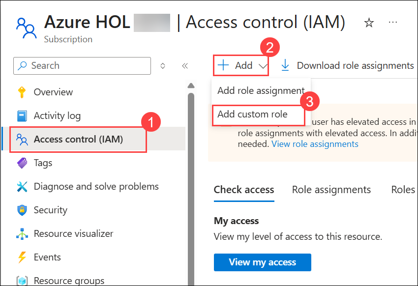

1. On the create a custom role page, Provide **Custom role name** as **start VM on connect** **(1)** and click on **Next** **(2)**.

   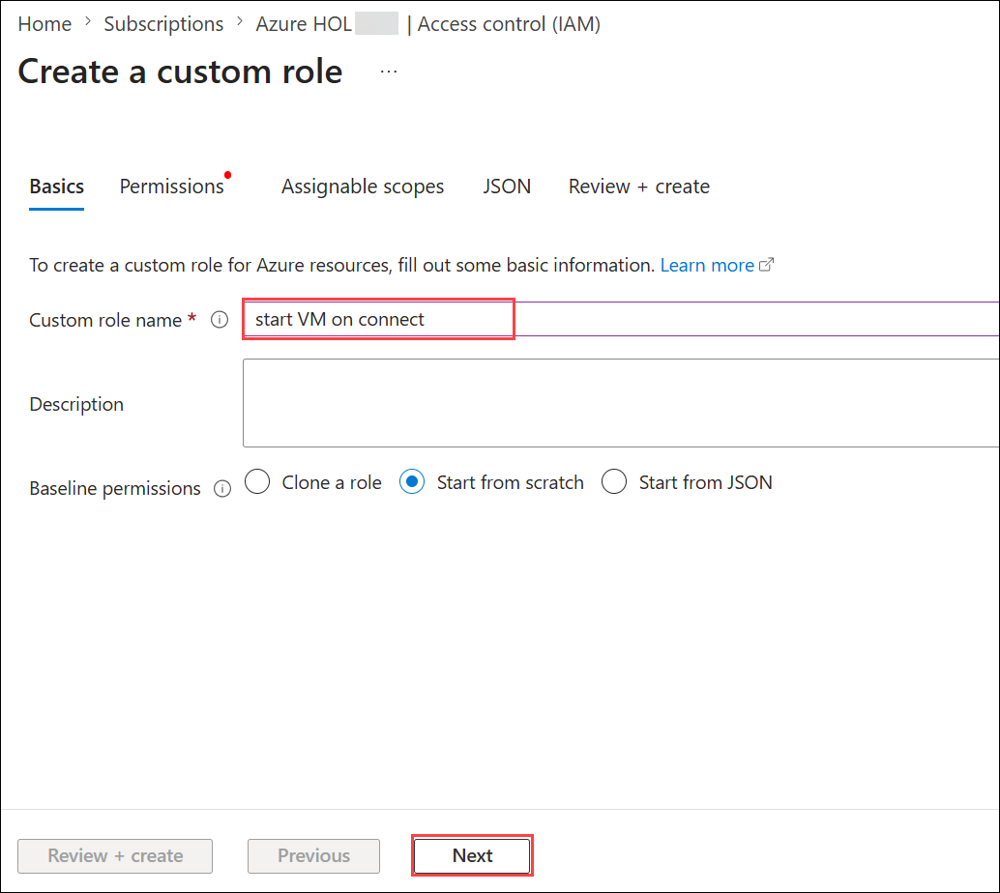

1. Under the Permissions tab, click on **+ Add Permissions**.

   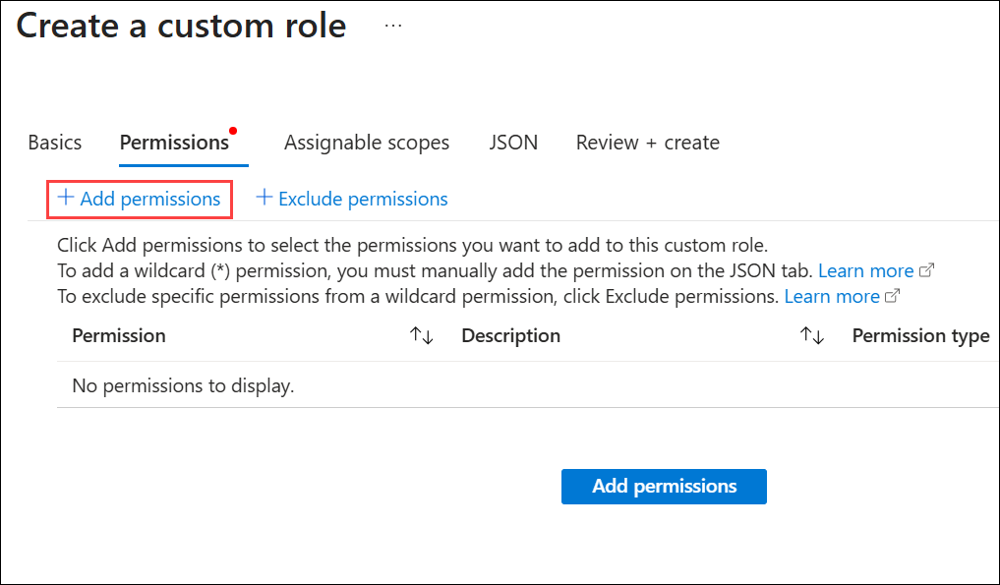

1. In Add Permissions search for **Virtual Machines** **(1)** and select **Microsoft Compute (2)** from the search results.

   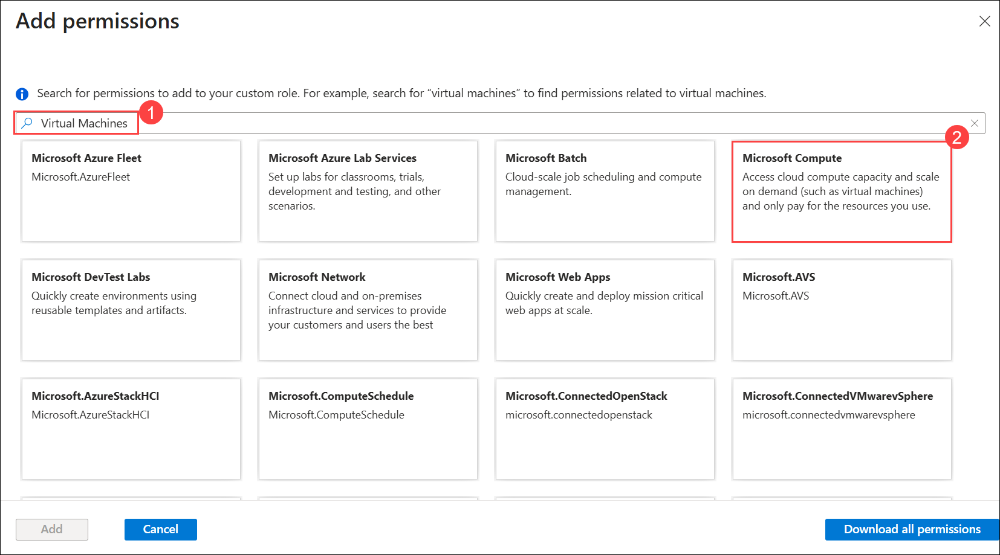

1. From the list of permissions, search for **Microsoft.Compute/virtualMachines** then select **Read : Get Virtual Machine** **(1)** and **Other : Start Virtual Machine** **(2)** and click on **Add** **(3)**.

   
  
1. Now click on **Review + Create** to publish the roles.. 

   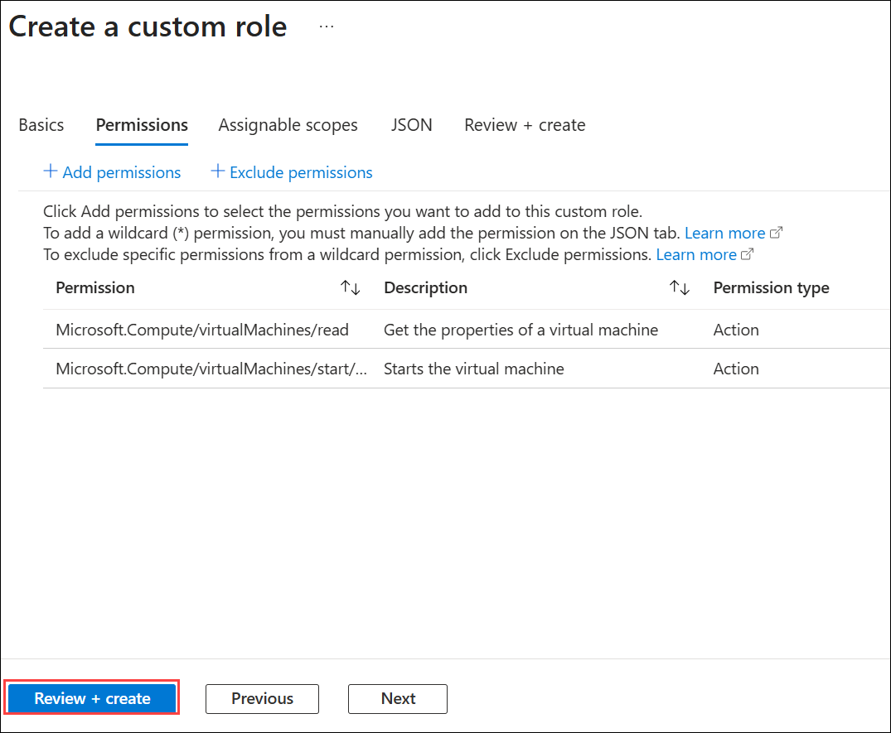
  
1. Review the configuration and click on **Create** and followed by **Ok**.

   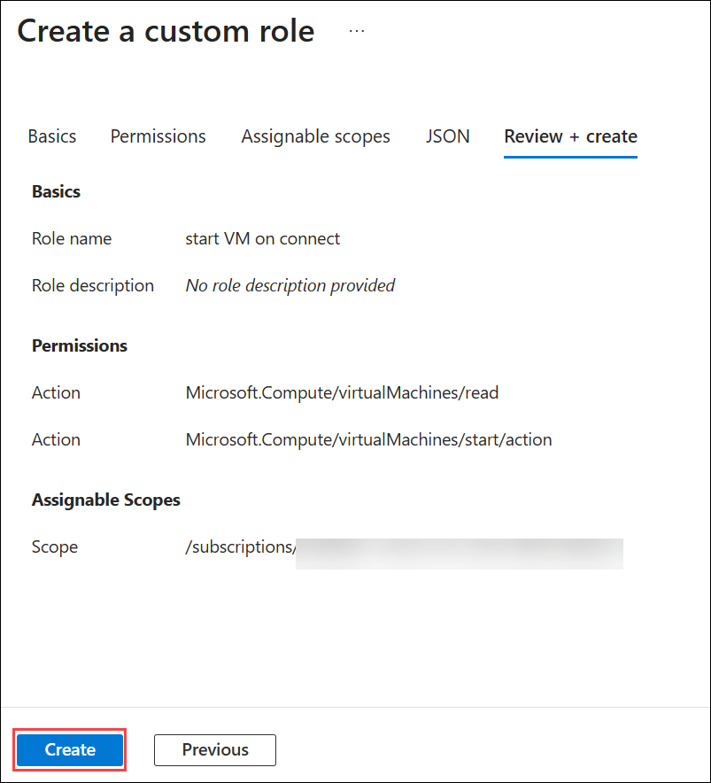

   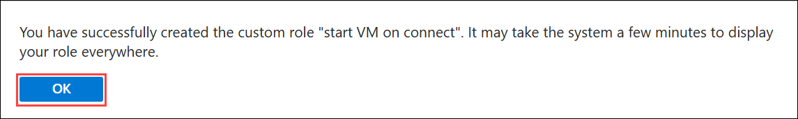

      >**Note**: If you encounter an error while creating the custom role indicating that a role with the same name already exists, you can skip the custom role creation steps and proceed directly to Exercise 2.

1. In **Access Control (IAM)** click on **+ Add**  and select **Add role assignment** .
  
   - Under Role, search and select **start VM on connect**, then click on **Next**.

     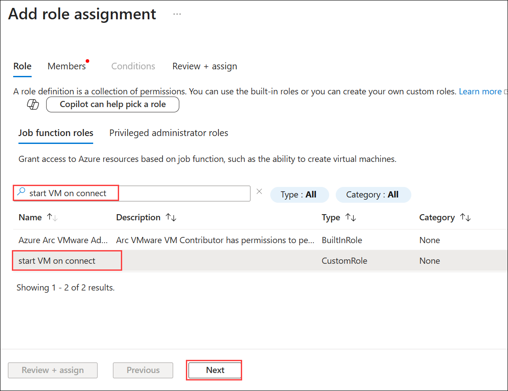
     
   - Under the **Members** tab, enter the below-mentioned details:

      - Assign access to: 	**User, group, or service principal (1)**
  
      - Click on **+ Select members (2)**
     
      - Under Select, search for **Azure Virtual desktop** and select it **(3)**
      
      - Click on **Select (4)**
   
         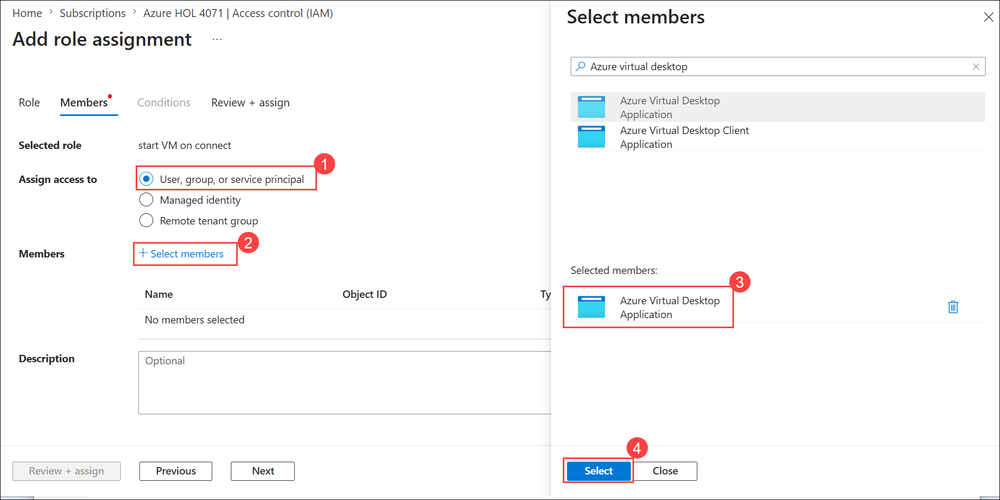
    
1. Click on **Review + assign**

   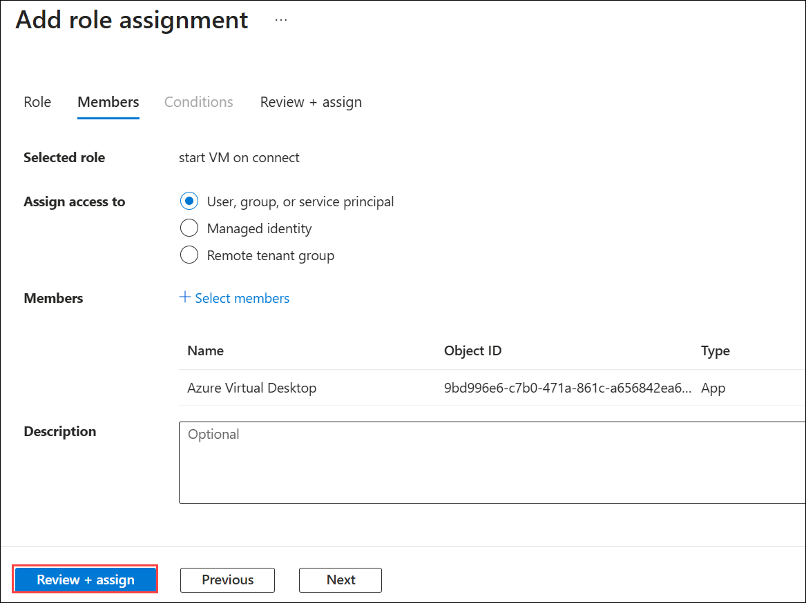

1. Review the configuration and click on **Review + assign**

   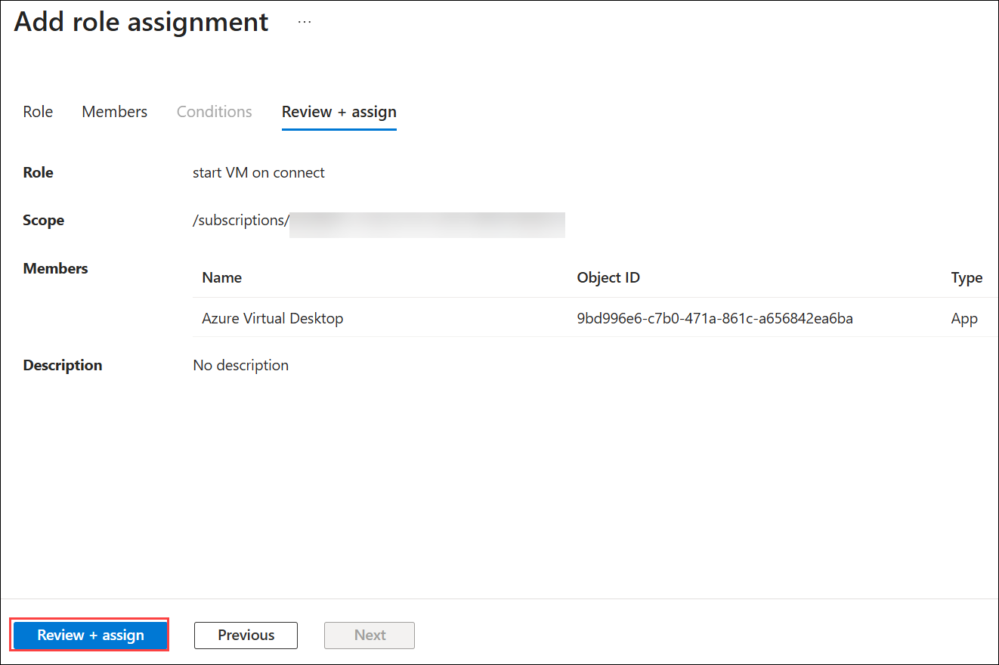

## Exercise 2: Configure the Start VM on Connect feature

### Task 1: Configuring Host Pool Properties

In this task, you will navigate to the Azure Virtual Desktop host pool, enable the Start VM on Connect feature in the host pool properties, and save the configuration so that session host VMs automatically start when a user tries to connect.

1. On the **Azure portal,** search for **Azure Virtual Desktop** **(1)** in the search bar and select **Azure Virtual Desktop** **(2)** from the suggestions.

   
  
1. On the left-hand side blade, click on **Host pools** **(1)** and select the **GS-AVD-HP** **(2)** we want to configure.

   
  
1. On the left-hand side blade of the Host pool page. Click on **Properties** **(1)**
  
   - Toggle **Start VM on connect** to **Yes** **(2)**.
   - Click on **Save** **(3)**.

      

## Exercise 3: Experience VM start on connect

### Task 1: Stop the Session host VMs

In this task, you will stop the Azure Virtual Desktop session host VMs from the Azure portal by selecting the virtual machines and confirming the shutdown when prompted.

1. In Azure Portal search for **Virtual Machines (1)** and select **Virtual Machines (2)**.

   

1. Select the **session host VMs** **(1)** and click on **Stop** **(2)**.

   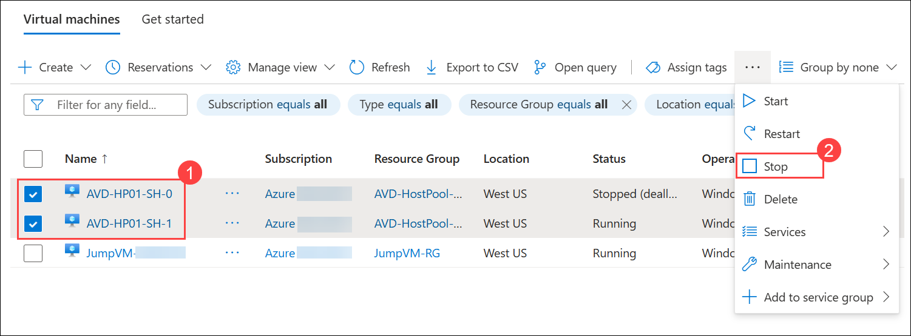
  
1. On a prompt saying "Do you want to stop the selected Virtual Machines" click on **Yes**.

   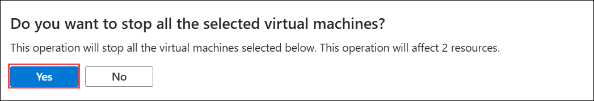
  
### Task 2: Access the Session host desktop

In this task, you will unsubscribe and resubscribe to the AVD workspace using the correct user credentials, launch the Session Desktop from the Remote Desktop client, sign in to access the virtual desktop, and verify that the session host VMs automatically start when the desktop connection is initiated.

1. Navigate to **Your Own PC/computer/workstation**, go to **Start** search for **Windows App** and open the application with the exact icon as shown below.

   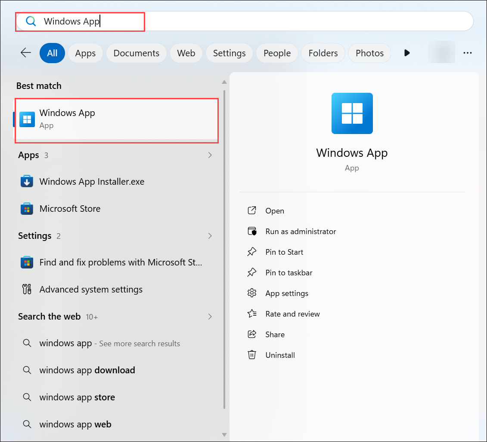
   
1. Click on the **account icon** in the top-right corner, then select **Sign in with another account**.

   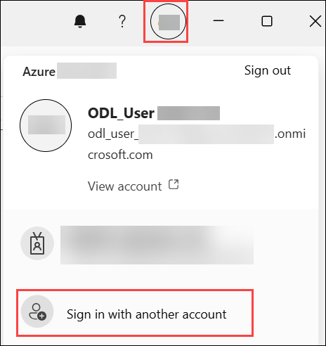

   >**Note:** We need to Sign in with another account because in Exercise 4 we already signed in with different user.

1. Enter the user credentials to access the workspace.

   - Username: Paste the username **<inject key="AzureAdUserEmail"></inject>** then click on **Next**.

     
   
   - Password: Paste the password  **<inject key="AzureAdUserPassword"></inject>** and click on **Sign in**.

      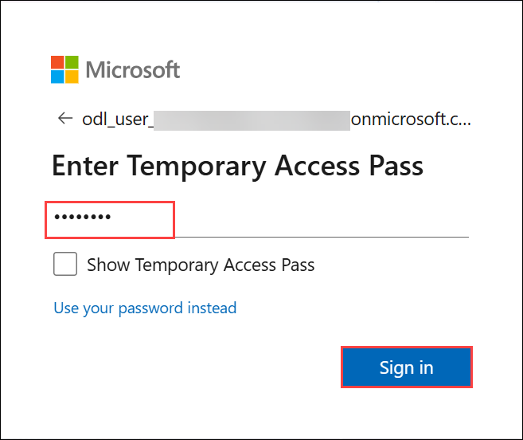

1. Return to AVD client application. On the AVD dashboard, click on the tile named **Session Desktop** to launch the desktop.

   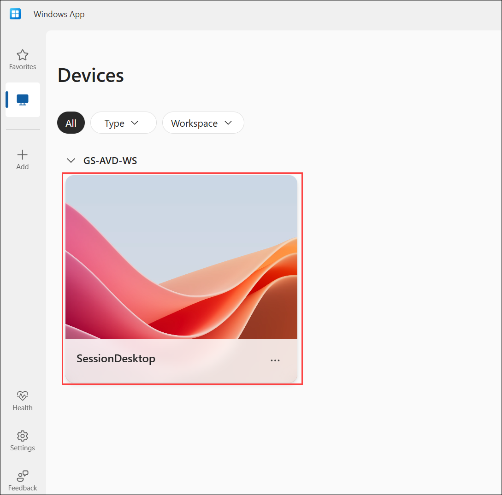
   
1. A window saying **Connecting to: Session Desktop** will appear. Wait for a few seconds, then enter your password to access the Desktop.

   > **Note:** If you are unable to sign in using the provided password, try logging in with the **AzurePassword** available in the **AzureCreds** file on the desktop.

   - Password: **<inject key="AzureAdUserPassword"></inject>**
   
     

1. Your virtual desktop will launch and look similar to the screenshot below. You can exit from the window by clicking on **X *i.e., the close button***. 

     
     
1. Return to the Azure portal and click on **refresh** **(1)** to get the updated status of Virtual Machines. Here, we can see the session hosts VM in the **Running** state and has started automatically when the session desktop was launched.

   

> **Congratulations** on completing the task! Now, it's time to validate it. Here are the steps:
- Scroll down and hit the Validate button in the lab guide for the corresponding task. If you receive a success message, you can proceed to the next task.
- If not, carefully read the error message and retry the step, following the instructions in the lab guide.
- If you need any assistance, please contact us at cloudlabs-support@spektrasystems.com. We are available 24/7 to help you out.

<validation step="3d66b36a-91fa-42d5-8d17-f1e17b43a996" />   
   
## Summary

In this lab, you enabled the Start VM on Connect feature to optimize Azure Virtual Desktop costs by creating and assigning a custom role and configuring the host pool to allow automatic VM startup. You then stopped the session host VMs, launched the AVD Session Desktop to validate that the VMs power on when a user connects, confirming successful cost-efficient on-demand access.

Now, click on **Next** from the lower right corner to move on to the next page.

  
